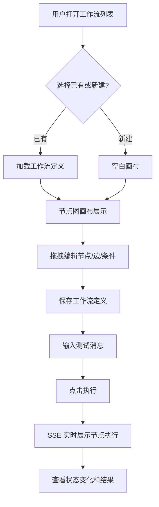

# PRD：x-langgraph 工作流可视化平台

## 1. 产品概述
配套 x-langgraph 后端的可视化前端，通过节点图直观展示 LangGraph 工作流的结构（节点、边、条件路由），支持拖拽编辑和实时执行可视化，帮助开发者快速理解工作流核心概念。
- **目标用户**：学习 LangGraph 的开发者
- **核心价值**：把抽象的代码定义变成可见、可编辑、可执行的图形

## 2. 核心功能

### 2.1 功能模块
1. **工作流管理**：列表展示、新建、编辑、删除工作流定义
2. **节点图编辑器**：Vue Flow 画布，支持节点/边/条件路由的拖拽编辑
3. **执行可视化**：调用后端 SSE 接口，实时高亮执行节点和命中的条件边
4. **状态检查器**：实时展示工作流 state 字段变化

### 2.2 页面详情
| 页面 | 模块 | 功能描述 |
|------|------|---------|
| 工作流列表 | 工作流卡片列表 | 展示所有工作流（intent_classifier / approval 等），支持搜索、新建、删除 |
| 工作流编辑器 | 节点图画布 | Vue Flow 画布，拖拽添加/移动节点，连线创建边，点击编辑条件路由 |
| 工作流编辑器 | 属性面板 | 选中节点/边后编辑属性（名称、类型、处理逻辑、条件表达式） |
| 工作流编辑器 | 状态检查器 | 执行时实时展示 state 字段变化（input/route/output/error/confidence） |
| 工作流编辑器 | 执行控制 | 输入测试消息、选择 session、点击执行、流式展示结果 |
| 工作流编辑器 | 执行日志 | 时间线展示节点执行顺序、耗时、路由决策理由 |

## 3. 核心流程

## 4. 用户界面设计

### 4.1 设计风格
- **主题**：深色科技风（背景 `#0a0a0f`，面板 `#13131a`）
- **主色**：电光青 `#00d4ff`（节点高亮、激活态）
- **辅助色**：琥珀 `#f59e0b`（条件边）、紫罗兰 `#a855f7`（路由节点）、翠绿 `#10b981`（成功）、绯红 `#ef4444`（错误）
- **字体**：JetBrains Mono（代码/数据）+ 系统无衬线（正文）
- **布局**：三栏式（左 240px 工作流列表 + 中间画布 + 右 320px 属性/状态面板）

### 4.2 页面设计概览
| 页面 | 模块 | UI 元素 |
|------|------|---------|
| 编辑器 | 节点画布 | Vue Flow 深色主题，节点带类型图标+状态色环，边带箭头和条件标签 |
| 编辑器 | 属性面板 | 折叠式表单，分组（基本信息 / 处理配置 / 条件表达式） |
| 编辑器 | 状态检查器 | JSON 树形展示，字段变化时高亮闪烁，路由置信度用进度条 |
| 编辑器 | 执行日志 | 垂直时间线，每步显示节点名+耗时+决策理由 |

### 4.3 响应式
桌面优先，最小宽度 1280px。画布区域自适应填充剩余空间。

### 4.4 交互细节
- 节点拖拽：按住节点可拖动位置，松手自动保存布局
- 连线：从节点右侧锚点拖出到目标节点左侧锚点，创建边
- 条件路由：双击条件边弹出表达式编辑器（字段 + 值 + 目标节点）
- 执行高亮：当前执行节点脉冲发光，已执行节点保持高亮，命中条件边流光动画
