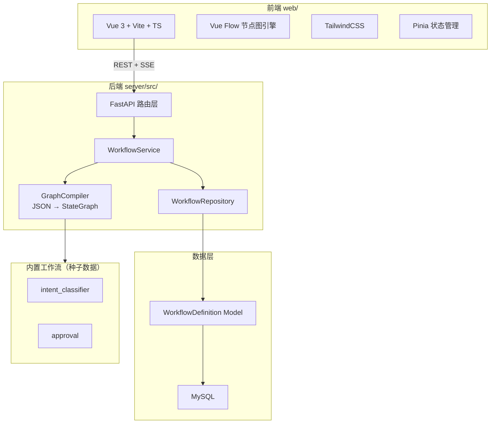
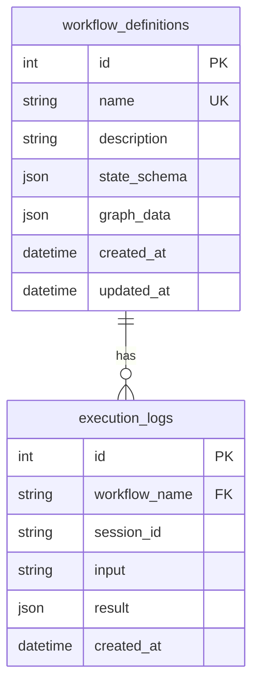

# 技术架构：x-langgraph 工作流可视化平台

## 1. 架构设计



## 2. 技术描述

### 前端（web/）
- **框架**：Vue 3 + Vite + TypeScript
- **节点图引擎**：Vue Flow（`@vue-flow/core` + `@vue-flow/background` + `@vue-flow/controls` + `@vue-flow/minimap`）
- **样式**：TailwindCSS
- **状态管理**：Pinia
- **HTTP**：原生 fetch（SSE 用 EventSource，REST 用 fetch）
- **初始化工具**：`npm create vite@latest`

### 后端（server/src/）新增
- **新增路由**：`api/routes/workflows.py` — 工作流定义 CRUD + 执行接口
- **新增服务**：`services/workflow_service.py` — 工作流业务逻辑
- **新增仓库**：`repositories/workflow_repository.py` — 数据持久化
- **新增模型**：`models/workflow_definition.py` — SQLAlchemy 实体
- **新增 Schema**：`schemas/workflow.py` — Pydantic 数据模型
- **新增编译器**：`workflows/compiler.py` — JSON 定义 → LangGraph StateGraph

## 3. 路由定义（前端）

| 路由 | 用途 |
|------|------|
| `/` | 工作流列表页 |
| `/editor/:name` | 工作流编辑器（:name 为工作流名称） |

## 4. API 定义（后端新增）

### 4.1 工作流定义 CRUD

```typescript
// 工作流定义
interface WorkflowDefinition {
  name: string;
  description: string;
  state_schema: Record<string, string>;  // 字段名 → 类型
  graph_data: GraphData;
  created_at: string;
  updated_at: string;
}

interface GraphData {
  nodes: NodeDef[];
  edges: EdgeDef[];
  entry_point: string;
}

interface NodeDef {
  id: string;
  type: 'router' | 'processor' | 'tool' | 'unknown';
  label: string;
  position: { x: number; y: number };
  handler: string;  // 处理函数标识，映射到后端实现
  config: Record<string, any>;
}

interface EdgeDef {
  id: string;
  source: string;
  target: string;
  type: 'normal' | 'conditional';
  condition?: { field: string; operator: string; value: string };
}
```

```
GET    /workflows                         // 列表
GET    /workflows/{name}                  // 详情（含完整 graph_data）
POST   /workflows                         // 创建
PUT    /workflows/{name}                  // 更新（含节点/边/布局）
DELETE /workflows/{name}                  // 删除
```

### 4.2 执行接口

```
POST   /workflows/{name}/execute          // 同步执行，返回最终结果
POST   /workflows/{name}/stream           // SSE 流式执行，实时推送节点事件
```

**SSE 事件格式**（复用现有 StreamEvent）：
```json
{
  "event": "node_start" | "node_end" | "state_update" | "done" | "error",
  "node": "router" | "search" | ...,
  "data": { "route": "weather", "output": "...", "confidence": 0.85 }
}
```

### 4.3 节点/边子资源 CRUD

```
POST   /workflows/{name}/nodes            // 添加节点
PUT    /workflows/{name}/nodes/{node_id}  // 更新节点
DELETE /workflows/{name}/nodes/{node_id}  // 删除节点

POST   /workflows/{name}/edges            // 添加边
PUT    /workflows/{name}/edges/{edge_id}  // 更新边
DELETE /workflows/{name}/edges/{edge_id}  // 删除边
```

## 5. 数据模型

### 5.1 数据模型定义



### 5.2 数据定义语言

```sql
CREATE TABLE workflow_definitions (
    id INT AUTO_INCREMENT PRIMARY KEY,
    name VARCHAR(100) NOT NULL UNIQUE,
    description VARCHAR(500) DEFAULT '',
    state_schema JSON NOT NULL,
    graph_data JSON NOT NULL,
    created_at DATETIME DEFAULT CURRENT_TIMESTAMP,
    updated_at DATETIME DEFAULT CURRENT_TIMESTAMP ON UPDATE CURRENT_TIMESTAMP
);

CREATE TABLE execution_logs (
    id INT AUTO_INCREMENT PRIMARY KEY,
    workflow_name VARCHAR(100) NOT NULL,
    session_id VARCHAR(100) NOT NULL,
    input TEXT,
    result JSON,
    created_at DATETIME DEFAULT CURRENT_TIMESTAMP,
    FOREIGN KEY (workflow_name) REFERENCES workflow_definitions(name) ON DELETE CASCADE
);
```

### 5.3 种子数据
系统启动时检查 `workflow_definitions` 表，若为空则从内置 Python 工作流（intent_classifier、approval）提取结构，生成 JSON 种子数据插入。

## 6. GraphCompiler 工作原理

将 JSON 定义编译为 LangGraph StateGraph 的核心逻辑：

```
1. 解析 graph_data JSON
2. 根据 state_schema 构建 TypedDict 状态类型
3. 遍历 nodes，映射 handler 标识 → Python 处理函数，add_node()
4. set_entry_point(entry_point)
5. 遍历 edges:
   - type=normal → add_edge(source, target)
   - type=conditional → add_conditional_edges(source, 路由函数, 映射表)
6. compile(checkpointer=...)
```

**Handler 映射表**（内置）：
| handler 标识 | 对应函数 |
|-------------|---------|
| `classify` | `workflows.intent_classifier.nodes.classify_intent` |
| `product_inquiry` | `workflows.intent_classifier.nodes.handle_product_inquiry` |
| `order_status` | `workflows.intent_classifier.nodes.handle_order_status` |
| `technical_support` | `workflows.intent_classifier.nodes.handle_technical_support` |
| `complaint` | `workflows.intent_classifier.nodes.handle_complaint` |
| `billing` | `workflows.intent_classifier.nodes.handle_billing` |
| `other` | `workflows.intent_classifier.nodes.handle_other` |
| `approval_request` | `workflows.approval.nodes.*` |
| `approval_review` | `workflows.approval.nodes.*` |

## 7. 前端目录结构

```
web/
├── src/
│   ├── views/
│   │   ├── WorkflowList.vue          # 工作流列表页
│   │   └── WorkflowEditor.vue        # 工作流编辑器（主页面）
│   ├── components/
│   │   ├── graph/
│   │   │   ├── WorkflowCanvas.vue    # Vue Flow 画布
│   │   │   ├── RouterNode.vue        # 自定义路由节点
│   │   │   ├── ProcessorNode.vue     # 自定义处理节点
│   │   │   └── ConditionEdge.vue     # 自定义条件边
│   │   ├── panels/
│   │   │   ├── PropertyPanel.vue     # 属性编辑面板
│   │   │   ├── StateInspector.vue    # 状态检查器
│   │   │   ├── ExecutionLog.vue      # 执行日志时间线
│   │   │   └── ExecuteBar.vue        # 执行控制栏
│   │   └── common/
│   │       ├── Modal.vue             # 通用弹窗
│   │       └── ConfirmDialog.vue     # 确认对话框
│   ├── api/
│   │   ├── http.ts                   # fetch 封装
│   │   ├── workflows.ts              # 工作流 CRUD API
│   │   └── sse.ts                    # SSE 客户端封装
│   ├── stores/
│   │   ├── workflow.ts               # 工作流状态
│   │   └── execution.ts              # 执行状态
│   ├── types/
│   │   └── workflow.ts               # TypeScript 类型定义
│   ├── App.vue
│   ├── main.ts
│   └── router.ts
├── index.html
├── package.json
├── vite.config.ts
├── tailwind.config.js
└── tsconfig.json
```

## 8. 开发联调配置

### Vite 代理（vite.config.ts）
```typescript
server: {
  proxy: {
    '/workflows': 'http://localhost:8000',
    '/chat': 'http://localhost:8000',
    '/approval': 'http://localhost:8000',
  }
}
```

### 开发流程
1. `server/` 下启动后端：`uvicorn src.main:app --reload`
2. `web/` 下启动前端：`npm run dev`
3. 前端通过 Vite 代理访问后端 API，无跨域问题
