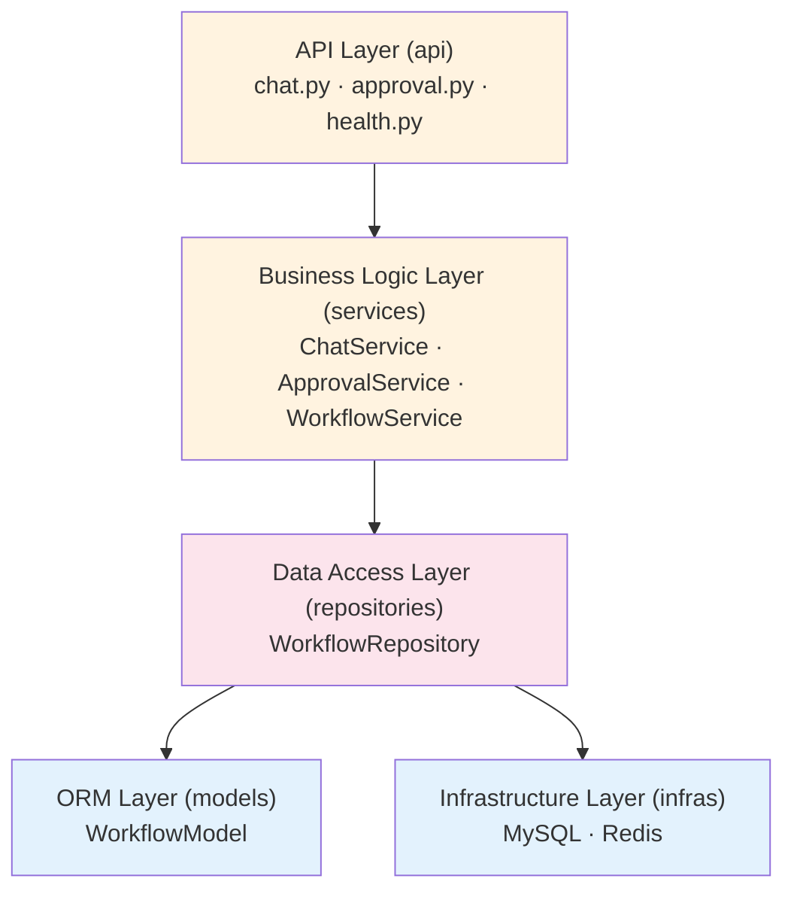
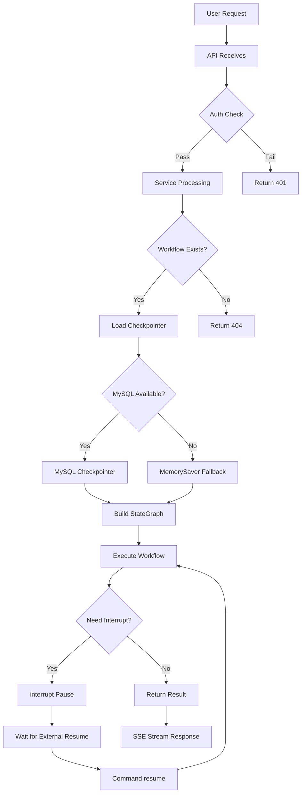
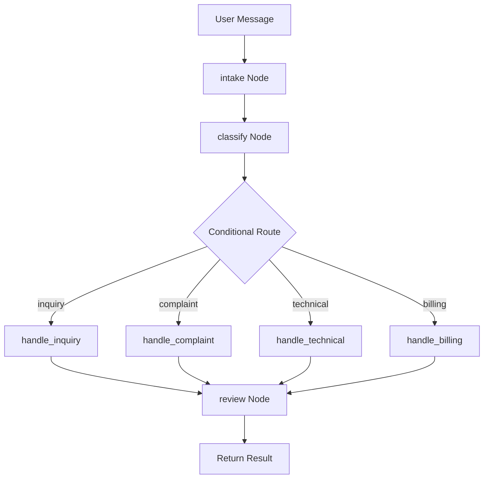
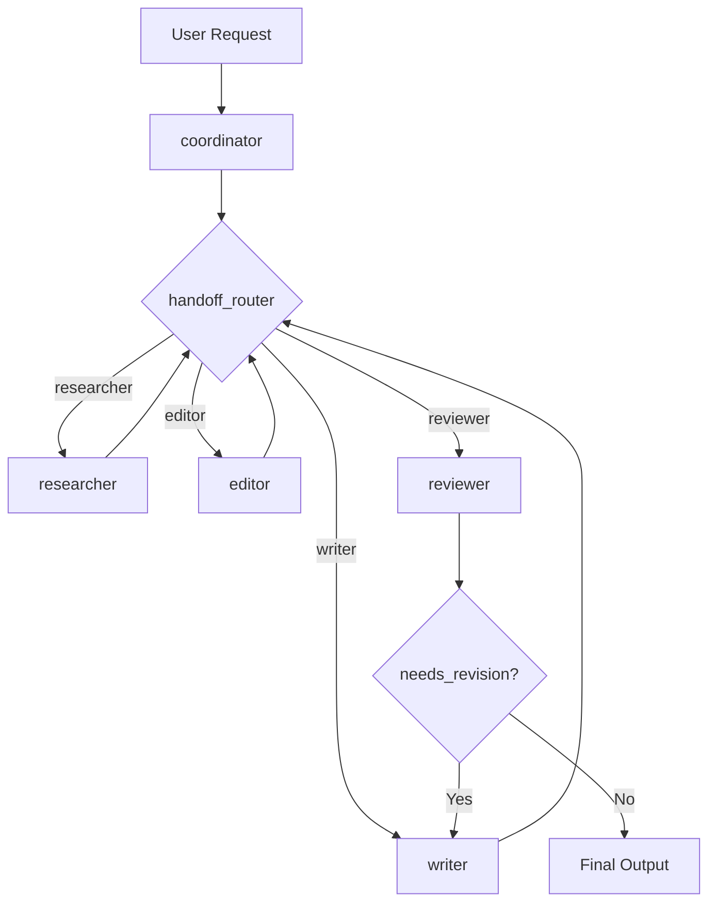
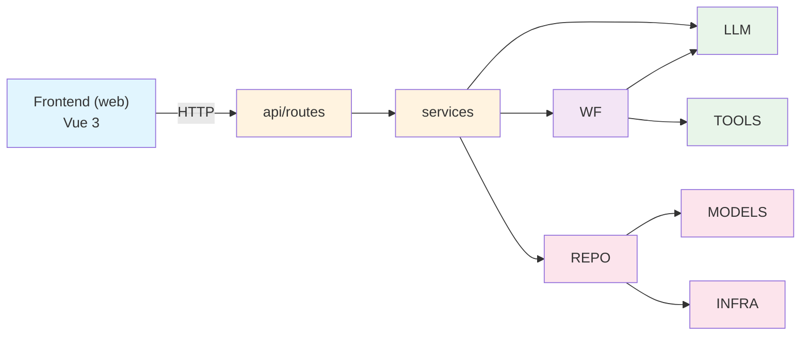

# x-langgraph

> A production-grade LangGraph workflow orchestration framework with **automated reasoning**, **autonomous decision-making**, **multi-step reasoning**, and **task planning** capabilities.

[](LICENSE)
[](https://www.python.org/)

## Project Introduction

**x-langgraph** is a production-grade workflow orchestration framework built on LangGraph, specializing in complex LLM application scenarios:

- **Automated Reasoning**: Built-in ReAct, Tree-of-Thought, Plan-and-Execute reasoning modes
- **Autonomous Decision-Making**: State-based conditional routing + LLM-driven dynamic decisions
- **Multi-Step Reasoning**: Iterative think-act-observe loops with mid-process reflection and replanning
- **Task Planning**: Complex task decomposition, visual execution tracking, dynamic plan adjustment

**Use Cases**:

| Scenario | Typical Use Cases |
|----------|-------------------|
| Intelligent Customer Service | Multi-turn dialogue, intent recognition, ticket routing, human-machine collaboration |
| RAG Q&A | Knowledge base retrieval, context building, multi-hop reasoning |
| Multi-Agent Collaboration | Task decomposition, role collaboration, iterative optimization |
| Automated Approval | Risk assessment, auto/manual approval, breakpoint recovery |
| Complex Business Processes | Conditional routing, state management, long流程 orchestration |

**Visual Interface**: Provides a Vue 3-based workflow visualization editor with drag-and-drop node editing, conditional routing configuration, and real-time state monitoring.

---

## Project Structure

```
x-langgraph/
├── server/                         # Backend API Service
│   ├── src/
│   │   ├── api/                   # API Layer
│   │   │   ├── routes/           # Route modules
│   │   │   └── router.py         # Route registration
│   │   ├── core/                  # Core Support Layer
│   │   │   ├── config.py         # Configuration
│   │   │   ├── logger.py         # Logging
│   │   │   ├── container.py      # IOC Container
│   │   │   └── middleware.py     # Middleware
│   │   ├── services/              # Business Logic Layer
│   │   │   ├── chat_service.py
│   │   │   ├── approval_service.py
│   │   │   └── workflow_service.py
│   │   ├── repositories/         # Data Access Layer
│   │   │   └── workflow_repository.py
│   │   ├── models/               # ORM Entity Layer
│   │   ├── infras/              # Infrastructure Layer
│   │   │   ├── mysql.py
│   │   │   ├── redis.py
│   │   │   └── http_client.py
│   │   ├── schemas/              # Pydantic Schema
│   │   ├── llm/                 # LLM Providers
│   │   │   ├── base.py
│   │   │   ├── deepseek.py
│   │   │   ├── doubao.py
│   │   │   └── aliyun.py
│   │   ├── tools/               # Tool Module
│   │   │   ├── weather/
│   │   │   ├── search/
│   │   │   └── calculation/
│   │   └── workflows/           # Workflow Module ⭐
│   │       ├── base.py          # BaseWorkflow Base Class
│   │       ├── compiler.py      # Graph Compiler
│   │       ├── checkpointer.py  # State Persistence
│   │       ├── reasoning/       # Reasoning Module
│   │       │   ├── react.py
│   │       │   ├── tree_of_thought.py
│   │       │   └── plan_execute.py
│   │       ├── intent_classifier/
│   │       ├── customer_service/
│   │       ├── rag_qa/
│   │       ├── multi_agent/
│   │       └── approval/
│   ├── examples/                # Example Code
│   ├── tests/                   # Test Code
│   ├── data/                    # Workflow Definition Files
│   ├── Dockerfile
│   └── docker-compose.yml
│
└── web/                         # Frontend (Vue 3)
    ├── src/
    │   ├── components/
    │   │   ├── graph/           # Workflow Canvas
    │   │   └── panels/         # Property Panels
    │   ├── stores/             # Pinia State Management
    │   ├── api/                # API Clients
    │   ├── views/              # Page Views
    │   └── router/
    └── package.json
```

---

## System Architecture

### 1. System Layered Architecture



> Note: Core Support Layer (`core`: config · logger · middleware) is referenced by all layers

**Layer Dependency Rules**: `api → service → repository → models/infras`

- **API Layer**: Parameter receiving, authentication, forwarding
- **Service Layer**: Business rules, transaction orchestration, multi-repository coordination
- **Repository Layer**: CRUD, multi-table queries, depends on infras for sessions
- **Models Layer**: Pure data table mapping
- **Infra Layer**: Third-party client encapsulation. **Never depends on upper layers.**

### 2. Core Business Flows

#### Workflow Execution Flow



#### Customer Service Flow



#### Multi-Agent Collaboration Flow



### 3. Module Dependency Graph



**Dependency Table**:

| Caller | Dependencies | Description |
|--------|--------------|-------------|
| `api` | `services`, `schemas` | Parameter validation, routing |
| `services` | `workflows`, `llm`, `repositories` | Business orchestration |
| `workflows` | `llm`, `tools`, `core/config` | Workflow execution |
| `repositories` | `models`, `infras/mysql` | Data persistence |
| `core` | No reverse dependencies | Referenced by all layers |

---

## Core Capabilities

### 1. Multiple Reasoning Modes

The framework includes **3 built-in reasoning modes** that can be composed into workflows:

| Mode | File | Workflow Structure | Use Cases |
|------|------|-------------------|-----------|
| **ReAct** | `react.py` | `reasoning → acting → observation → reflection` loop | Tool calling, search augmentation |
| **Tree-of-Thought** | `tree_of_thought.py` | `generate → evaluate → select → ...` tree search | Creative generation, solution exploration |
| **Plan-and-Execute** | `plan_execute.py` | `planner → executor → reflector → replan` | Complex task decomposition |

### 2. Dynamic Branching & Conditional Routing

```python
# Multi-Agent Handoff Mode
workflow.add_conditional_edges(
    "coordinator",
    handoff_router,
    {
        "researcher": "researcher",
        "writer": "writer",
        "editor": "editor",
        "reviewer": "reviewer",
    },
)
```

### 3. State Persistence & Breakpoint Recovery

- **MySQL Checkpointer**: Production-grade state persistence
- **Auto-fallback**: Reverts to MemorySaver when MySQL is unavailable
- **Human-in-the-Loop**: `interrupt` + `Command(resume)` for human interaction

### 4. Multi-Agent Collaboration

Supports Handoff mode, parallel tasks, and tool calling.

---

## Workflow Examples

This framework includes **5 built-in workflows**:

### 1. Intent Classification Router

```
START → classify → [Conditional Route]
                   ├→ product_inquiry → END
                   ├→ order_status → END
                   ├→ technical_support → END
                   ├→ complaint → END
                   └→ billing → END
```
**Features**: LLM intent classification + rule fallback + 6 business categories

### 2. Customer Service

```
START → intake → classify → [Conditional Route]
                   ├→ handle_inquiry → review → END
                   ├→ handle_complaint → review → END
                   ├→ handle_technical → review → END
                   └→ handle_billing → review → END
```
**Features**: Multi-level conditional routing + Checkpointer state persistence + 4 ticket types

### 3. RAG Document Q&A

```
START → init → [Needs Clarification?] → clarify → END
                    ↓
              retrieve → [Sufficient Retrieval?] → build_context → generate → END
                                     ↓
                               generate → END
```
**Features**: Vector retrieval + context building + LLM generation + fallback handling

### 4. Multi-Agent Collaboration

```
START → coordinator → [handoff_router]
                      ├→ researcher → [handoff_router]
                      │                ├→ writer
                      │                └→ ...
                      ├→ writer → [handoff_router]
                      ├→ editor → [handoff_router]
                      └→ reviewer → [needs_revision?] → writer
                                     ↓
                               [approved] → END
```
**Features**: Handoff mode (control transfer between agents) + 5 roles collaboration + iterative revision

### 5. Automated Approval

```
START → submit → evaluate → [Risk Assessment Route]
                          ├→ auto_approve → notify → END
                          └→ human_approval → [interrupt] → notify → END
```
**Features**: Auto evaluation + risk assessment + Human-in-the-Loop + notification

---

## Quick Start

### Environment Requirements

- Python 3.11+
- uv package manager
- Docker Desktop (optional)

### Install & Run

```bash
# Clone project
git clone https://github.com/yeyushilai/x-langgraph.git
cd x-langgraph

# Install dependencies
cd server && uv sync

# Configure environment variables
cp .env.example .env
# Edit .env to configure LLM API Key

# Docker one-click start (recommended)
docker-compose up -d

# Or local development
uv run python -m examples.hello_world
```

### Run Reasoning Examples

```python
# ReAct Reasoning
from workflows.reasoning import ReactWorkflow, ReasoningConfig

config = ReasoningConfig(max_iterations=5)
workflow = ReactWorkflow(config=config, tools={"search": search_tool})
result = await workflow.ainvoke({"messages": [HumanMessage(content="...")]})

# Plan-and-Execute
from workflows.reasoning import create_plan_execute_workflow

workflow = create_plan_execute_workflow(config)
result = workflow.run("Help me analyze competitors and develop a marketing strategy")
```

---

## Core Features

| Feature | Description |
|---------|-------------|
| **Multi-Reasoning Modes** | ReAct, Tree-of-Thought, Plan-and-Execute |
| **Multi-Agent Collaboration** | Handoff mode, role division, iterative optimization |
| **State Persistence** | MySQL Checkpointer + Auto-fallback |
| **Human-in-the-Loop** | interrupt/resume for human interaction |
| **Multi-LLM Support** | DeepSeek, Doubao, Alibaba Tongyi |
| **Streaming Output** | SSE streaming responses |
| **Unified Base Class** | All workflows inherit BaseWorkflow |
| **Layered Architecture** | API → Service → Repository → Models → Infra |
| **Docker Deployment** | One-click containerized deployment |
| **Visual Editor** | Vue Flow workflow editor |

---

## Tech Stack

### Backend

| Category | Technology |
|---------|------------|
| Web Framework | FastAPI + Uvicorn |
| LLM Framework | LangGraph + LangChain |
| Data Storage | MySQL + SQLAlchemy |
| Data Validation | Pydantic |
| Logging | Loguru |
| Package Manager | uv |

### Frontend

| Category | Technology |
|---------|------------|
| Framework | Vue 3 + TypeScript |
| Build | Vite |
| State Management | Pinia |
| Graph Visualization | Vue Flow |
| UI | Tailwind CSS |

---

## API Documentation

Access after starting the service:

- Swagger UI: http://localhost:8000/docs
- ReDoc: http://localhost:8000/redoc

### Core Endpoints

| Endpoint | Method | Description |
|----------|--------|-------------|
| `/chat` | POST | Chat conversation |
| `/chat/stream` | POST | Streaming chat |
| `/workflows/{name}/execute` | POST | Execute workflow |
| `/workflows/{name}/stream` | POST | Stream execute |
| `/approval/resume` | POST | Resume approval |

---

## License

MIT License

## References

- [LangGraph Official Documentation](https://langchain-ai.github.io/langgraph/)
- [LangGraph Chinese Tutorial](https://langchain-doc.cn/v1/python/langgraph/)
- [FastAPI Official Documentation](https://fastapi.tiangolo.com/)

---

**Let's explore the infinite possibilities of LangGraph together!** 🚀
