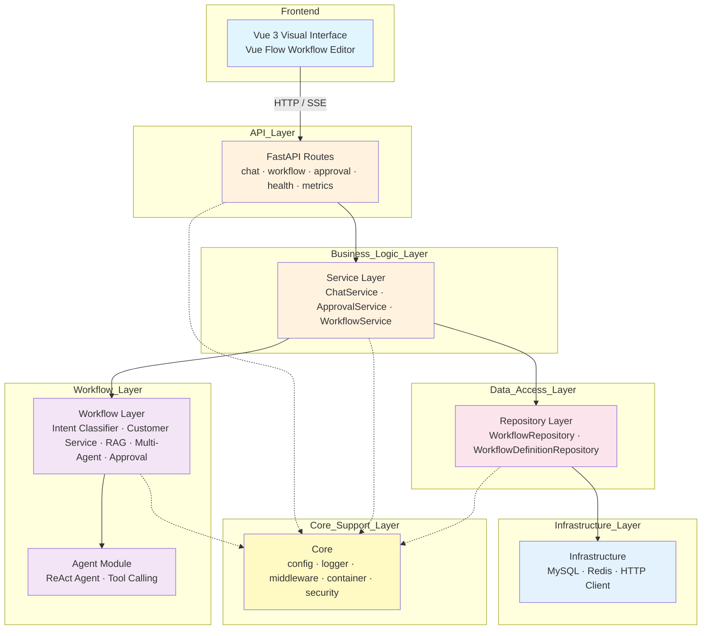
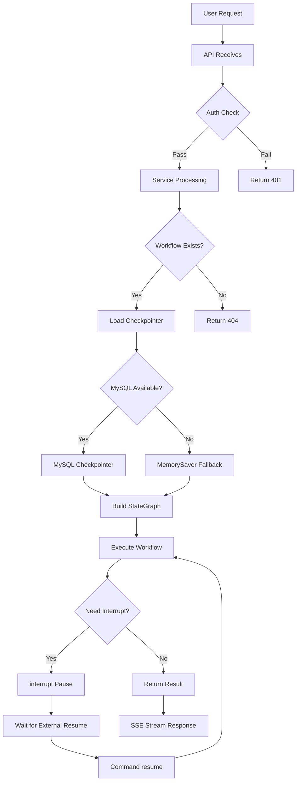
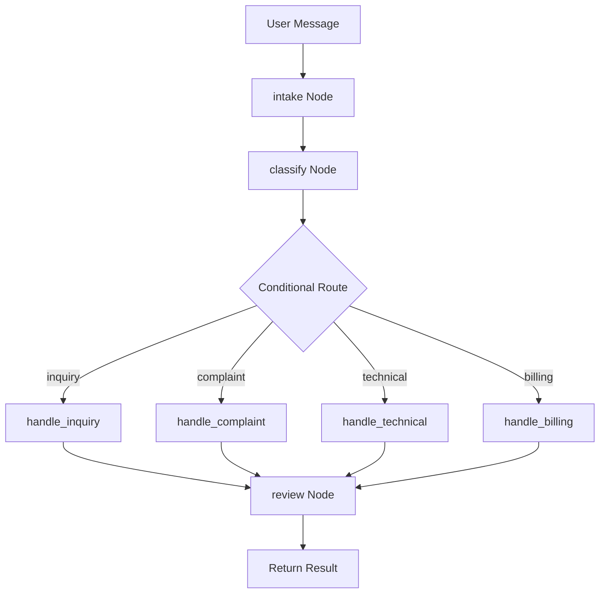
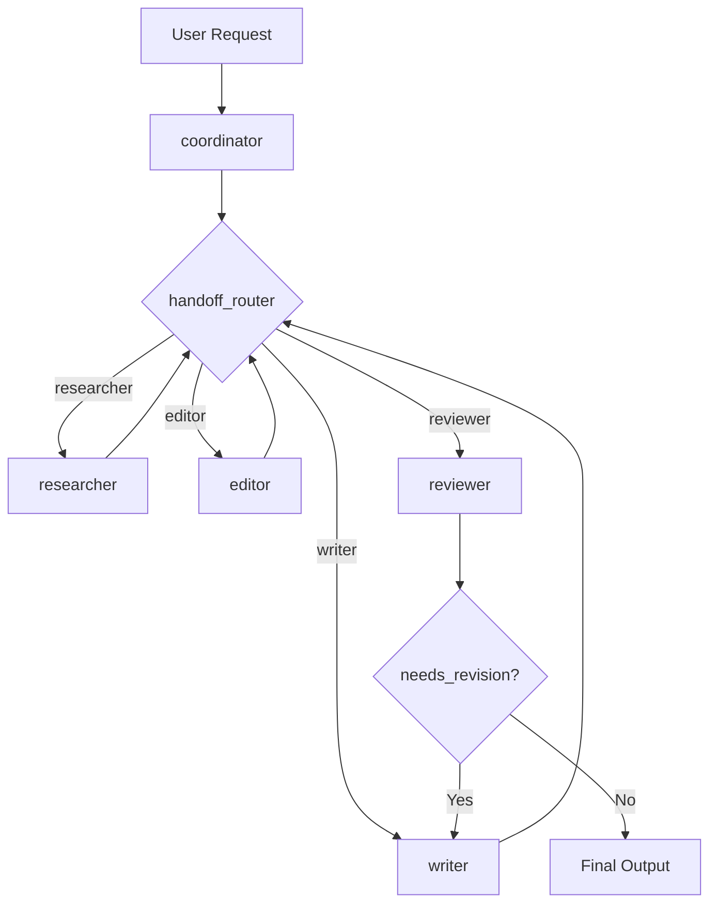

[中文](README.md) | English

# x-langgraph

[](LICENSE)
[](https://www.python.org/)
[](https://langchain-ai.github.io/langgraph/)

## Project Introduction

**x-langgraph** is a production-grade workflow orchestration framework built on LangGraph, providing **automated reasoning**, **autonomous decision-making**, **multi-step reasoning**, and **task planning** capabilities for complex LLM application scenarios.

**Core Value**:
- Built-in ReAct, Tree-of-Thought, and Plan-and-Execute reasoning modes, ready to use out of the box
- State graph-based conditional routing + LLM-driven dynamic decision engine
- Human-in-the-Loop collaboration and breakpoint recovery
- Layered architecture (API → Service → Workflow → Repository → Infra), easy to extend and maintain
- Vue 3 visual workflow editor with drag-and-drop node orchestration

**Use Cases**: Intelligent customer service, RAG document Q&A, multi-agent collaboration, automated approval, complex business process orchestration.

---

## Quick Start

### 1. Environment Requirements

| Dependency | Version | Description |
|------------|---------|-------------|
| Python | >= 3.11 | Recommended 3.11 or 3.12 |
| uv | Latest | Python package manager, alternative to pip |
| Docker | >= 20.10 | Optional, for containerized deployment |
| Docker Compose | >= 2.0 | Optional, for multi-container orchestration |
| Node.js | >= 18 | Optional, only for frontend development |
| MySQL | >= 8.0 | Optional, for state persistence |

**Platform Setup**:

| Platform | Installation |
|----------|--------------|
| **Windows** | Install [Python 3.11+](https://www.python.org/downloads/windows/), [Git](https://git-scm.com/download/win), [uv](https://docs.astral.sh/uv/getting-started/installation/); PowerShell or Git Bash recommended |
| **Linux** | `sudo apt install python3.11 python3.11-venv git` (Ubuntu/Debian); uv via `curl -LsSf https://astral.sh/uv/install.sh \| sh` |
| **macOS** | `brew install python@3.11 git`; uv via `curl -LsSf https://astral.sh/uv/install.sh \| sh` |

### 2. Clone the Repository

```bash
git clone https://github.com/chain-engine/x-langgraph.git
cd x-langgraph
```

### 3. Install Dependencies

```bash
# Enter backend directory
cd server

# Install dependencies with uv (recommended)
uv sync

# Install dev dependencies (optional)
uv sync --extra dev
```

> This project uses uv for dependency management. Avoid using pip unless necessary. To use pip, activate the virtual environment first: `uv venv && source .venv/bin/activate` (Linux/macOS) or `.venv\Scripts\activate` (Windows).

### 4. Environment Configuration

```bash
# Copy environment variable template
cp .env.example .env
```

Edit the `.env` file to configure core parameters:

| Parameter | Description | Example |
|-----------|-------------|---------|
| `DEEPSEEK_API_KEY` | DeepSeek API key | `sk-xxx` |
| `DEEPSEEK_API_BASE` | DeepSeek API endpoint | `https://api.deepseek.com/v1` |
| `DEEPSEEK_MODEL_NAME` | DeepSeek model name | `deepseek-chat` |
| `DOUBAO_API_KEY` | Doubao API key | `sk-xxx` |
| `DOUBAO_API_BASE` | Doubao API endpoint | `https://ark.cn-beijing.volces.com/api/v3` |
| `ALIYUN_API_KEY` | Alibaba Cloud Bailian API key | `sk-xxx` |
| `ALIYUN_API_BASE` | Alibaba Cloud Bailian API endpoint | `https://dashscope.aliyuncs.com/compatible-mode/v1` |
| `DB_HOST` | MySQL host | `localhost` |
| `DB_PORT` | MySQL port | `3306` |
| `DB_USER` | MySQL username | `root` |
| `DB_PASSWORD` | MySQL password | `your_password` |
| `DB_NAME` | MySQL database name | `x-langgraph` |

> At least one LLM provider API key must be configured. Priority: Mimo > DeepSeek > Doubao > Alibaba Cloud > Mock.

### 5. Start the Service

#### Option 1: Local Development with Hot Reload (Recommended)

```bash
cd server
uv run python -m src.main
```

After startup, visit: http://localhost:8000

#### Option 2: Docker Container Deployment

```bash
cd server
docker-compose up -d
```

Includes MySQL database + FastAPI application containers, one-click startup.

#### Option 3: uvicorn Direct Start

```bash
cd server
uv run uvicorn src.main:app --host 0.0.0.0 --port 8000 --reload
```

### 6. Common Engineering Commands

```bash
# Run unit tests
uv run pytest

# Code formatting
uv run black src/ tests/

# Static code analysis
uv run ruff check src/ tests/

# Type checking
uv run mypy src/

# Dependency vulnerability scan
uv run pip-audit
```

### 7. Usage Examples

#### API Call Example

```bash
# Chat conversation
curl -X POST http://localhost:8000/v1/chat/execute \
  -H "Content-Type: application/json" \
  -d '{"message": "Hello, please introduce yourself", "workflow_name": "customer_service"}'

# Streaming chat
curl -X POST http://localhost:8000/v1/chat/stream \
  -H "Content-Type: application/json" \
  -d '{"message": "Help me analyze the weather", "workflow_name": "react"}'
```

#### Python SDK Example

```python
from src.workflows.base import BaseWorkflow
from src.workflows.compiler import WorkflowCompiler

# Use ReAct reasoning mode
config = {"max_iterations": 5, "tools": ["search", "weather"]}
compiler = WorkflowCompiler()
workflow = compiler.compile("react", config)
result = workflow.invoke({"messages": [("user", "What's the weather in Beijing today?")]})
```

---

## Project Structure

```
x-langgraph/
├── server/                              # Backend API Service
│   ├── src/
│   │   ├── main.py                      # Application entry point
│   │   ├── api/                         # API Layer
│   │   │   ├── router.py               # Route registration
│   │   │   └── v1/                     # API v1
│   │   │       ├── chat.py             # Chat endpoints
│   │   │       ├── workflow.py         # Workflow management endpoints
│   │   │       ├── approval.py         # Approval endpoints
│   │   │       ├── health.py           # Health check endpoint
│   │   │       └── metrics.py          # Monitoring metrics endpoint
│   │   ├── core/                        # Core Support Layer
│   │   │   ├── config.py               # Configuration (env vars + YAML)
│   │   │   ├── logger.py               # Logging (Loguru)
│   │   │   ├── container.py            # IOC dependency injection
│   │   │   ├── middleware.py           # Middleware
│   │   │   ├── security.py             # Security authentication
│   │   │   └── exceptions.py           # Exception definitions
│   │   ├── services/                    # Business Logic Layer
│   │   │   ├── chat_service.py         # Chat service
│   │   │   ├── approval_service.py     # Approval service
│   │   │   └── workflow_service.py     # Workflow definition service
│   │   ├── workflows/                   # Workflow Module
│   │   │   ├── base.py                 # BaseWorkflow base class
│   │   │   ├── compiler.py             # Graph compiler
│   │   │   ├── checkpointer.py         # State persistence
│   │   │   ├── intent_classifier/      # Intent classification workflow
│   │   │   ├── customer_service/       # Customer service workflow
│   │   │   ├── rag_qa/                 # RAG Q&A workflow
│   │   │   ├── multi_agent/            # Multi-agent collaboration workflow
│   │   │   └── approval/               # Automated approval workflow
│   │   ├── agent/                       # Agent Module
│   │   │   ├── base.py                 # Agent base class
│   │   │   ├── react_agent.py          # ReAct Agent
│   │   │   ├── factory.py              # Agent factory
│   │   │   └── registry.py             # Agent registry
│   │   ├── llms/                        # LLM Providers
│   │   │   ├── providers.py            # Unified LLM interface
│   │   │   └── prompts.py              # Prompt templates
│   │   ├── tools/                       # Tools Module
│   │   │   ├── weather_tool.py         # Weather query tool
│   │   │   ├── search_tools.py         # Search tool
│   │   │   └── calculation_tools.py    # Calculation tool
│   │   ├── repositories/               # Data Access Layer
│   │   │   ├── workflow_repository.py
│   │   │   └── workflow_definition_repository.py
│   │   ├── models/                      # ORM Entity Layer
│   │   ├── schemas/                     # Pydantic Schemas
│   │   ├── infras/                      # Infrastructure Layer
│   │   │   ├── mysql.py                # MySQL connection
│   │   │   ├── redis.py                # Redis connection
│   │   │   └── http_client.py          # HTTP client
│   │   └── constants/                   # Constants
│   ├── tests/                           # Test code
│   ├── examples/                        # Example code
│   ├── data/                            # Workflow definition files
│   ├── pyproject.toml                   # Project config (dependencies, build)
│   ├── .env.example                     # Environment variable template
│   ├── Dockerfile                       # Docker image build
│   └── docker-compose.yml               # Docker Compose orchestration
│
└── web/                                 # Frontend (Vue 3)
    ├── src/
    │   ├── components/                  # Components
    │   │   ├── graph/                   # Workflow canvas (Vue Flow)
    │   │   └── panels/                  # Property panels
    │   ├── views/                       # Page views
    │   ├── stores/                      # Pinia state management
    │   ├── api/                         # API client
    │   └── router/                      # Router config
    ├── package.json                     # Frontend dependencies
    └── vite.config.ts                   # Vite build config
```

**Core Directory Guide**:

| Directory | Purpose |
|-----------|---------|
| `server/src/api/` | HTTP interface layer, handles request reception, parameter validation, response return |
| `server/src/services/` | Business logic layer, orchestrates workflow execution, approval processes, chat management |
| `server/src/workflows/` | Workflow definition layer, core implementation of 5 built-in workflows |
| `server/src/agent/` | Agent module, ReAct Agent and tool calling |
| `server/src/llms/` | Unified LLM interface, supports DeepSeek, Doubao, Alibaba Cloud |
| `server/src/repositories/` | Data access layer, encapsulates database operations |
| `server/src/infras/` | Infrastructure layer, MySQL, Redis, HTTP client |
| `web/src/components/graph/` | Frontend workflow canvas, Vue Flow-based visual editor |

---

## System Architecture

### System Layered Architecture



**Layer Dependency Rules**: `Frontend → API → Service → Workflows/Repositories → Infra` (Core referenced by all layers)

### Workflow Execution Flow



### Customer Service Flow



### Multi-Agent Collaboration Flow



---

## Tech Stack

| Category | Technology | Description |
|----------|------------|-------------|
| **Language** | Python 3.11+ | Backend primary language |
| **Web Framework** | FastAPI + Uvicorn | High-performance async API framework |
| **LLM Framework** | LangGraph + LangChain | Workflow orchestration and LLM integration |
| **Data Storage** | MySQL 8.0 + SQLAlchemy | Relational database + ORM |
| **Cache** | Redis | Optional, for caching and session management |
| **Data Validation** | Pydantic v2 | Type-safe data models |
| **Logging** | Loguru | Structured logging |
| **Package Manager** | uv | Fast Python package manager |
| **Frontend Framework** | Vue 3 + TypeScript | Reactive frontend framework |
| **Build Tool** | Vite | Fast build tool |
| **Graph Visualization** | Vue Flow | Workflow canvas editor |
| **UI Framework** | Tailwind CSS | Atomic CSS framework |
| **State Management** | Pinia | Vue 3 state management |
| **Deployment** | Docker + Docker Compose | Containerized deployment |

---

## API Documentation

After starting the service, access API documentation at:

| Doc Type | URL | Description |
|----------|-----|-------------|
| Swagger UI | http://localhost:8000/docs | Interactive API docs with online debugging |
| ReDoc | http://localhost:8000/redoc | Read-only API docs, clear structure |
| OpenAPI JSON | http://localhost:8000/openapi.json | OpenAPI 3.0 specification file |

### Core API Endpoints

| Endpoint | Method | Description |
|----------|--------|-------------|
| `/v1/chat/execute` | POST | Chat conversation (sync) |
| `/v1/chat/stream` | POST | Streaming chat (SSE) |
| `/v1/workflows` | GET | List workflows |
| `/v1/workflows/{name}` | GET | Get workflow details |
| `/v1/workflows` | POST | Create workflow |
| `/v1/workflows/{name}` | PUT | Update workflow |
| `/v1/workflows/{name}` | DELETE | Delete workflow |
| `/v1/workflows/{name}/nodes` | POST | Add node |
| `/v1/workflows/{name}/nodes` | PUT | Update node |
| `/v1/workflows/{name}/nodes` | DELETE | Delete node |
| `/v1/workflows/{name}/edges` | POST | Add edge |
| `/v1/workflows/{name}/edges` | PUT | Update edge |
| `/v1/workflows/{name}/edges` | DELETE | Delete edge |
| `/v1/workflows/{name}/execute` | POST | Execute workflow |
| `/v1/workflows/{name}/stream` | POST | Stream execute workflow |
| `/v1/approval/resume` | POST | Resume approval process |
| `/v1/approval/status/{session_id}` | GET | Query approval status |
| `/v1/health` | GET | Health check |
| `/v1/metrics` | GET | Monitoring metrics |

**Access Control**: Current version API endpoints have no authentication requirements (development mode). For production, configure access keys via `API_KEY` environment variable, or integrate OAuth2 / JWT authentication.

---

## Storage Configuration

### MySQL Database

Used for LangGraph Checkpoint state persistence and workflow definition storage.

| Parameter | Env Variable | Default | Description |
|-----------|--------------|---------|-------------|
| Host | `DB_HOST` | `localhost` | MySQL server address |
| Port | `DB_PORT` | `3306` | MySQL service port |
| Username | `DB_USER` | `root` | Database username |
| Password | `DB_PASSWORD` | - | Database password |
| Database | `DB_NAME` | - | Database name |
| Pool Size | `DB_POOL_SIZE` | `10` | Max connections in pool |
| Max Overflow | `DB_MAX_OVERFLOW` | `20` | Extra connections beyond pool |

**Notes**:
- When MySQL is unavailable, the system automatically falls back to in-memory Checkpointer (MemorySaver), data will not persist
- Docker Compose deployment automatically initializes the MySQL container

### Redis (Optional)

Used for caching and session management.

| Parameter | Env Variable | Default | Description |
|-----------|--------------|---------|-------------|
| Host | `REDIS_HOST` | `localhost` | Redis server address |
| Port | `REDIS_PORT` | `6379` | Redis service port |
| Password | `REDIS_PASSWORD` | - | Redis password |
| Database | `REDIS_DB` | `0` | Redis database number |

### Local File Storage

Workflow definition files are stored in the `server/data/` directory, log files are output to the `server/logs/` directory.

---

## License

This project is open-sourced under the [MIT License](LICENSE).

---

## References

| Technology | Official Documentation |
|------------|----------------------|
| Python | https://www.python.org/ |
| uv | https://docs.astral.sh/uv/ |
| LangGraph | https://langchain-ai.github.io/langgraph/ |
| LangChain | https://python.langchain.com/ |
| FastAPI | https://fastapi.tiangolo.com/ |
| SQLAlchemy | https://docs.sqlalchemy.org/ |
| Pydantic | https://docs.pydantic.dev/ |
| Loguru | https://loguru.readthedocs.io/ |
| Docker | https://docs.docker.com/ |
| Vue 3 | https://vuejs.org/ |
| Vue Flow | https://vueflow.dev/ |
| Tailwind CSS | https://tailwindcss.com/ |

---

## Contact

- **Author**: John Young (夜雨诗来)
- **Email**: john.young@foxmail.com
- **Gitee**: https://gitee.com/yeyushilai
- **GitHub**: https://github.com/yeyushilai
- **Project**: https://github.com/chain-engine/x-langgraph
