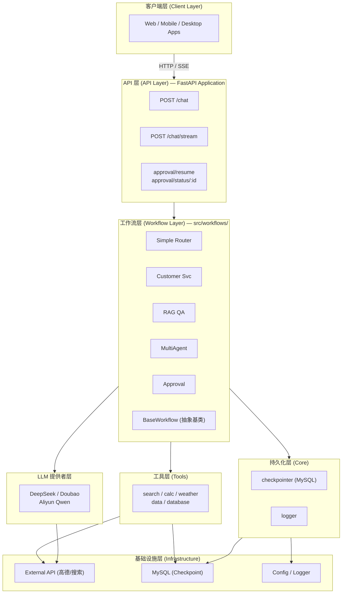
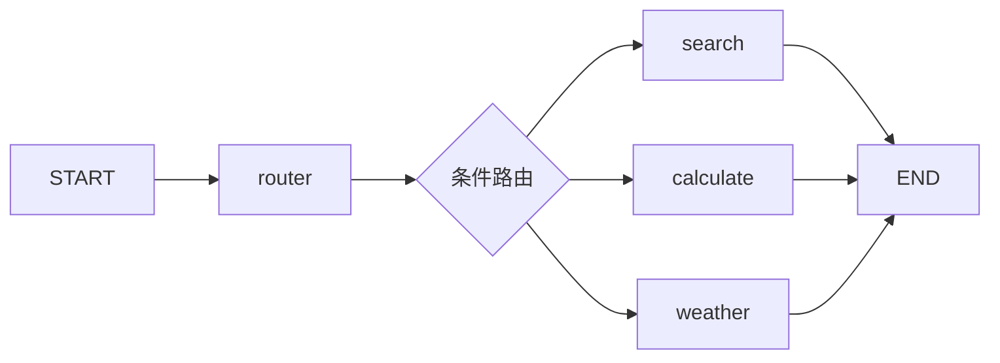
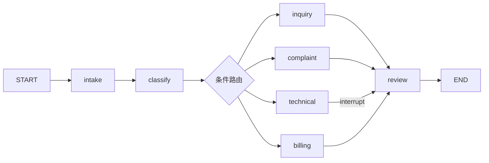
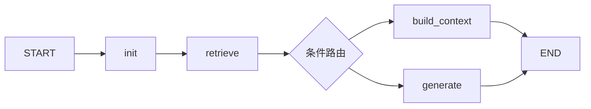
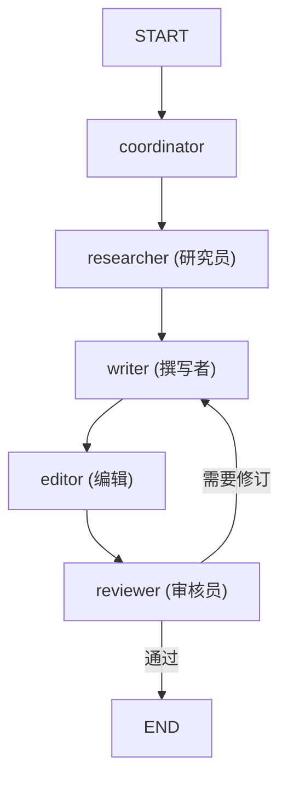
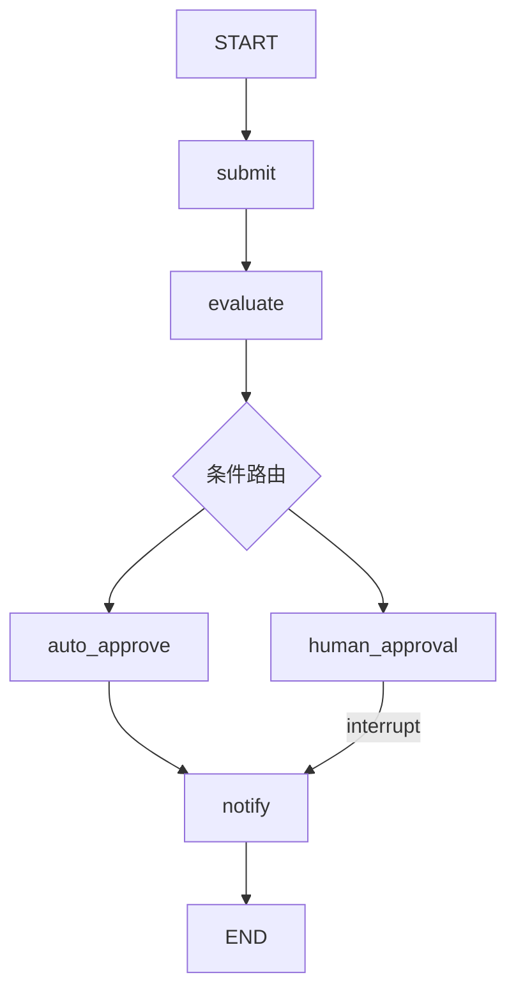
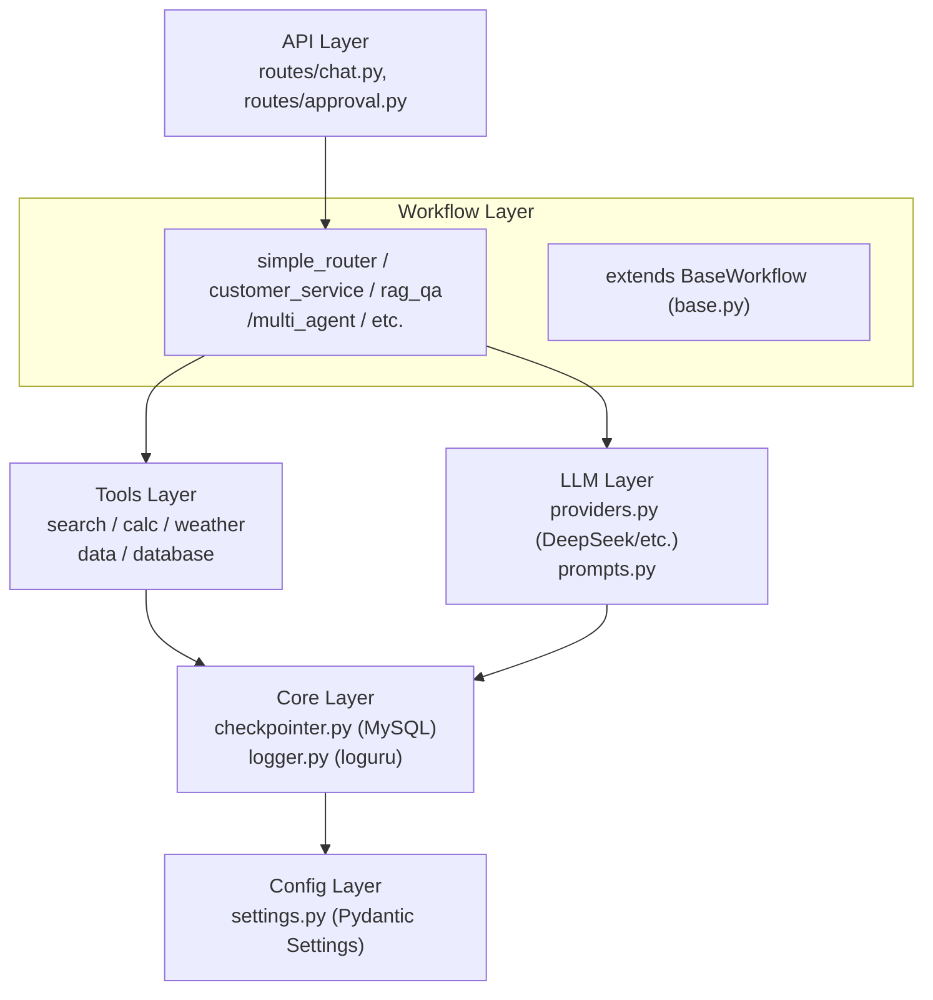

# x-langgraph

## 项目简介

**x-langgraph** 是一个生产级的 LangGraph 工作流编排框架，旨在帮助开发者快速构建基于大语言模型的复杂多步骤工作流应用。本项目采用工程化、模块化设计，提供完整的工作流示例和生产级部署方案，可作为企业级应用的参考模板。

**适用场景**：
- 智能客服系统（多轮对话、意图识别、工单流转）
- RAG 文档问答（知识库检索、上下文构建）
- 多智能体协作（任务分解、并行执行、结果汇总）
- 自动化审批流程（风险评估、人机交互）
- 复杂业务流程编排（条件路由、状态管理）

## 什么是 LangGraph

`LangGraph` 是 LangChain 生态系统中的一个专门用于工作流编排的框架，它提供了一种声明式的方式来定义和执行基于语言模型的复杂工作流。

### LangGraph 与 LangChain 的关系

| 特性 | LangChain | LangGraph |
|------|-----------|-----------|
| 定位 | 通用 LLM 应用开发框架 | 专注工作流编排和状态管理 |
| 核心能力 | 模型调用、提示管理、工具集成 | 状态图、条件路由、持久化 |
| 适用场景 | 简单链式调用 | 复杂多步骤工作流 |
| 状态管理 | 无状态 | 有状态（支持 Checkpointer） |
| 人机交互 | 不支持 | 支持（interrupt/resume） |

### LangGraph 核心概念

| 概念 | 说明 | 示例 |
|------|------|------|
| **StateGraph** | 状态图，工作流的核心容器 | `StateGraph(MyState)` |
| **State** | 工作流状态，使用 TypedDict 定义 | `class MyState(TypedDict): ...` |
| **Node** | 节点，执行具体任务的函数 | `def my_node(state): return {...}` |
| **Edge** | 边，定义节点间的流转 | `graph.add_edge("a", "b")` |
| **Conditional Edge** | 条件边，根据状态动态路由 | `graph.add_conditional_edges(...)` |
| **Checkpointer** | 状态持久化器 | `MemorySaver()` / `MySQLSaver` |
| **interrupt** | 中断执行，等待外部输入 | `interrupt({"type": "approval"})` |
| **Command** | 恢复执行的命令 | `Command(resume={...})` |

### 工作流基类设计

所有工作流继承自 `BaseWorkflow`，统一接口：

```python
class BaseWorkflow(ABC):
    @abstractmethod
    def build(self) -> CompiledGraph: ...

    # 同步方法
    def invoke(self, inputs, config): ...
    def stream(self, inputs, config): ...

    # 异步方法（推荐）
    async def ainvoke(self, inputs, config): ...
    async def astream(self, inputs, config): ...
```

### Provider 模式（工具解耦）

工具支持多数据源，通过 Provider 模式解耦：

```
tools/weather/
├── base.py           # WeatherProvider (ABC)
├── mock_provider.py  # Mock 实现（测试用）
├── amap_provider.py  # 高德 API 实现
└── __init__.py       # 工厂函数 get_weather_provider()
```

### 智能路由（LLM + 降级）

Simple Router 支持 LLM 语义理解 + 规则降级：

```python
def router_node(state):
    if settings.has_valid_api_key():
        try:
            return _llm_routing(state["input"])  # LLM 理解语义
        except Exception:
            pass
    return _fallback_routing(state["input"])     # 规则降级
```

## 核心特征

- **多工作流支持**：内置 5 种典型工作流（简单路由、智能客服、RAG问答、多智能体协作、自动化审批）
- **状态持久化**：基于 MySQL 的 Checkpointer 实现，支持工作流中断与恢复
- **Human-in-the-Loop**：支持人工审批、中断恢复等交互式场景
- **多 LLM 提供者**：支持 DeepSeek、豆包、阿里云等主流大模型
- **Provider 模式**：工具与数据源解耦，支持 Mock 测试和真实 API 切换
- **流式输出**：支持 SSE 流式响应，提升用户体验
- **统一基类**：所有工作流继承 `BaseWorkflow`，接口一致
- **Docker 部署**：提供完整的容器化部署方案

## 项目结构

```
x-langgraph/
├── src/                          # 业务代码（源码目录）
│   ├── api/                      # API 服务层
│   │   ├── main.py               # FastAPI 应用入口
│   │   ├── schemas.py            # 数据模型定义
│   │   └── routes/               # 路由模块
│   │       ├── chat.py           # 聊天接口
│   │       └── approval.py       # 审批接口
│   │
│   ├── config/                   # 配置管理
│   │   └── settings.py           # 环境变量配置
│   │
│   ├── constants/                # 常量定义
│   │   ├── develop.py            # 开发相关常量
│   │   └── streaming_modes.py    # 流式模式常量
│   │
│   ├── core/                     # 核心功能
│   │   ├── logger.py             # 日志模块（loguru）
│   │   └── checkpointer.py       # MySQL 状态持久化
│   │
│   ├── llm/                      # LLM 提供者模块
│   │   ├── providers.py          # LLM 提供者（DeepSeek/豆包/阿里云）
│   │   └── prompts.py            # 提示模板管理
│   │
│   ├── tools/                    # 工具模块
│   │   ├── base.py               # 工具基类
│   │   ├── search_tools.py       # 搜索工具
│   │   ├── calculation_tools.py  # 计算工具
│   │   ├── weather_tools.py      # 天气工具
│   │   ├── data_tools.py         # 数据处理工具
│   │   └── database_tools.py     # 数据库工具（Text2SQL）
│   │
│   └── workflows/                # 工作流模块
│       ├── base.py               # 工作流基类（BaseWorkflow）
│       ├── simple_router/        # 简单路由工作流
│       ├── customer_service/     # 智能客服工作流
│       ├── rag_qa/               # RAG 文档问答工作流
│       ├── multi_agent/          # 多智能体协作工作流
│       └── approval/             # 自动化审批工作流
│
├── docker/                       # Docker 配置
│   └── mysql/
│       └── init.sql              # MySQL 初始化脚本
│
├── examples/                     # 示例代码
│   ├── hello_world.py            # 基础示例
│   ├── agent_workflow.py         # 基础工作流示例
│   ├── demo_workflows.py         # 高级工作流示例
│   └── langgraph_platform.py     # LangGraph Platform 部署示例
│
├── tests/                        # 测试代码
├── .env                          # 环境变量配置
├── .env.example                  # 环境变量模板
├── Dockerfile                    # Docker 镜像配置
├── docker-compose.yml            # Docker 编排配置
├── langgraph.json                # LangGraph Platform 配置
└── pyproject.toml                # 项目配置
```

## 系统架构

### 系统分层架构图



### 核心功能业务流程图

#### 1. 简单路由工作流 (Simple Router)



**核心特性**: 条件边路由、工具调用、LLM 语义理解 + 规则降级

#### 2. 智能客服工作流 (Customer Service)



**核心特性**: 多级条件路由、Human-in-the-Loop、Checkpointer 状态持久化

#### 3. RAG 文档问答工作流



**核心特性**: 向量检索、上下文构建、LLM 生成、降级处理

#### 4. 多智能体协作工作流



**核心特性**: 任务分解、智能体协作、迭代优化、并行执行

#### 5. 自动化审批工作流



**核心特性**: 自动评估、风险评估、Human-in-the-Loop、通知发送

### 模块依赖关系图



## 快速开始

### 环境要求

#### Windows

- Python 3.11+
- uv 包管理器（[安装指南](https://docs.astral.sh/uv/)）
- Docker Desktop（可选，用于容器化部署）

```powershell
# 安装 uv
powershell -ExecutionPolicy ByPass -c "irm https://astral.sh/uv/install.ps1 | iex"

# 验证安装
uv --version
python --version
```

#### Linux / macOS

- Python 3.11+
- uv 包管理器
- Docker & Docker Compose（可选）

```bash
# 安装 uv
curl -LsSf https://astral.sh/uv/install.sh | sh

# 验证安装
uv --version
python3 --version
```

### 项目克隆

```bash
# 从 Gitee 克隆
git clone https://gitee.com/chain-engine/x-langgraph.git
cd x-langgraph

# 或从 GitHub 克隆
git clone https://github.com/yeyushilai/x-langgraph.git
cd x-langgraph
```

### 依赖安装

```bash
# 使用 uv 安装依赖（推荐）
uv sync

# 激活虚拟环境
# Windows
.venv\Scripts\activate
# Linux/macOS
source .venv/bin/activate
```

### 配置文件创建

```bash
# 复制环境变量模板
cp .env.example .env
```

编辑 `.env` 文件，配置必要的参数：

```bash
# LLM API 配置（至少配置一个）
DEEPSEEK_API_KEY=your_deepseek_api_key_here
DEEPSEEK_API_BASE=https://api.deepseek.com/v1
DEEPSEEK_MODEL_NAME=deepseek-chat

# Checkpoint 数据库配置（MySQL）
CHECKPOINT_DB_HOST=localhost
CHECKPOINT_DB_PORT=3306
CHECKPOINT_DB_USER=root
CHECKPOINT_DB_PASSWORD=123456
CHECKPOINT_DB_NAME=x-langgraph

# API 服务配置
API_HOST=0.0.0.0
API_PORT=8000
API_RELOAD=true
```

### 服务启动

#### 方式一：Docker 一键启动（推荐）

```bash
# 一键启动（MySQL + API 服务）
docker-compose up -d

# 查看日志
docker-compose logs -f api

# 测试服务
curl http://localhost:8000/health
```

服务启动后：
- API 地址: http://localhost:8000
- API 文档: http://localhost:8000/docs

#### 方式二：本地开发

```bash
# 1. 启动 MySQL（使用 Docker）
docker run -d \
  --name x-langgraph-mysql \
  -e MYSQL_ROOT_PASSWORD=123456 \
  -e MYSQL_DATABASE=x-langgraph \
  -p 3306:3306 \
  mysql:8.0

# 2. 启动 API 服务
uv run python -m api.main

# 或使用 uvicorn
uv run uvicorn api.main:app --host 0.0.0.0 --port 8000 --reload

# 3. 运行示例
uv run python -m examples.hello_world
```

### 常用命令

```bash
# Docker 相关
docker-compose up -d          # 启动服务
docker-compose down           # 停止服务
docker-compose logs -f api    # 查看日志
docker-compose restart api    # 重启 API

# 本地开发
uv run python -m api.main              # 启动 API
uv run python -m examples.hello_world  # 运行示例
uv run pytest tests/ -v                # 运行测试

# 代码质量
uv run black src/ tests/               # 代码格式化
uv run ruff check src/ tests/          # 代码检查
uv run mypy src/                       # 类型检查
```

## 技术栈

| 分类 | 技术 | 说明 |
|------|------|------|
| **Web 框架** | FastAPI | 高性能异步 Web 框架 |
| **ASGI 服务器** | Uvicorn | 支持 SSE 流式响应 |
| **LLM 框架** | LangGraph | 工作流编排核心 |
| | LangChain | 模型调用、工具集成 |
| **数据存储** | MySQL | Checkpointer 状态持久化 |
| | SQLAlchemy | ORM 框架 |
| **数据验证** | Pydantic | 数据模型、配置管理 |
| **日志** | Loguru | 结构化日志 |
| **HTTP 客户端** | httpx | 异步 HTTP 请求 |
| **部署工具** | Docker | 容器化部署 |
| | Docker Compose | 多容器编排 |
| **包管理** | uv | 快速 Python 包管理器 |

## API 文档

服务启动后，可通过以下地址访问 API 文档：

| 文档类型 | 地址 | 说明 |
|----------|------|------|
| Swagger UI | http://localhost:8000/docs | 交互式 API 文档 |
| ReDoc | http://localhost:8000/redoc | 只读 API 文档 |
| OpenAPI JSON | http://localhost:8000/openapi.json | OpenAPI 规范文件 |

### 核心 API 接口

| 接口 | 方法 | 说明 |
|------|------|------|
| `/` | GET | 健康检查 |
| `/health` | GET | 健康检查 |
| `/chat` | POST | 同步聊天 |
| `/chat/stream` | POST | 流式聊天（SSE） |
| `/approval/resume` | POST | 恢复审批工作流 |
| `/approval/status/{id}` | GET | 获取审批状态 |

### 接口示例

```bash
# 同步聊天
curl -X POST http://localhost:8000/chat \
  -H "Content-Type: application/json" \
  -d '{"message": "北京天气", "session_id": "test-123", "workflow": "simple_router"}'

# 流式聊天（SSE）
curl -X POST http://localhost:8000/chat/stream \
  -H "Content-Type: application/json" \
  -d '{"message": "你好", "session_id": "test-456"}'
```

## 存储配置

### 本地存储（MySQL Checkpointer）

用于 LangGraph 工作流状态持久化，支持中断恢复：

```bash
# .env 配置
CHECKPOINT_DB_HOST=localhost
CHECKPOINT_DB_PORT=3306
CHECKPOINT_DB_USER=root
CHECKPOINT_DB_PASSWORD=123456
CHECKPOINT_DB_NAME=x-langgraph
```

### 对象存储（可选）

如需 RAG 文档存储，可配置对象存储服务（如 MinIO、阿里云 OSS 等）。

## 许可证

本项目采用 MIT 许可证，详情请查看 [LICENSE](LICENSE) 文件。

## 参考资料

- [LangGraph 官方文档](https://langchain-ai.github.io/langgraph/)
- [LangChain 文档](https://python.langchain.com/docs/get_started/introduction)
- [LangGraph 中文教程](https://langchain-doc.cn/v1/python/langgraph/)
- [FastAPI 官方文档](https://fastapi.tiangolo.com/)
- [Python 官方文档](https://docs.python.org/3/)
- [uv 包管理器](https://docs.astral.sh/uv/)

## 联系方式

- **作者**: John Young
- **邮箱**: john.young@foxmail.com
- **Gitee**: https://gitee.com/yeyushilai
- **GitHub**: https://github.com/yeyushilai

---

**让我们一起探索 LangGraph 的无限可能！** 🚀
