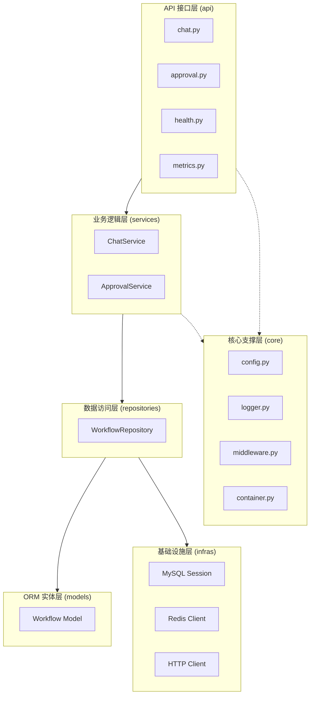
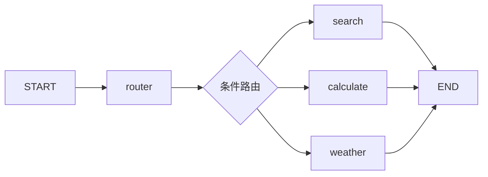
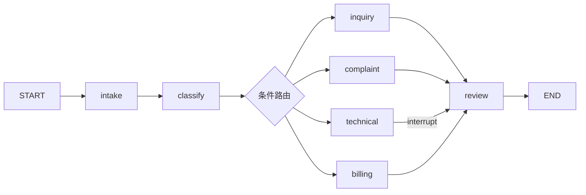
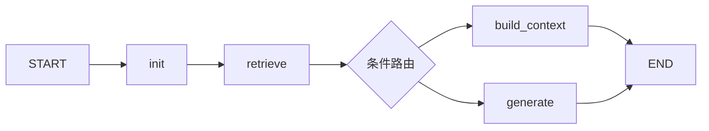
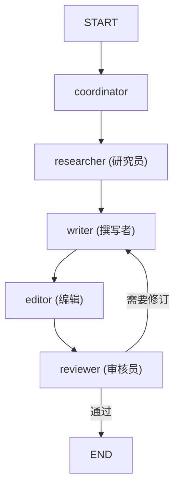
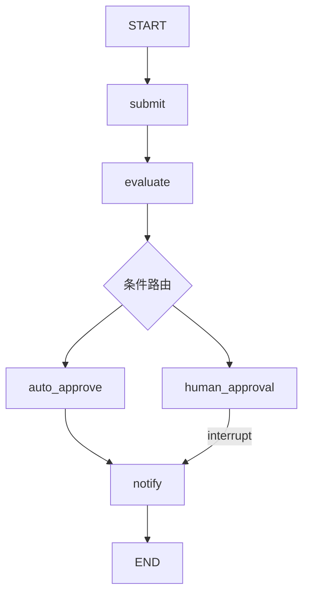

# x-langgraph

## 项目简介

**x-langgraph** 是一个生产级的 LangGraph 工作流编排框架，旨在帮助开发者快速构建基于大语言模型的复杂多步骤工作流应用。本项目采用工程化、模块化设计，提供完整的工作流示例和生产级部署方案，可作为企业级应用的参考模板。

**适用场景**：

- 智能客服系统（多轮对话、意图识别、工单流转）
- RAG 文档问答（知识库检索、上下文构建）
- 多智能体协作（任务分解、并行执行、结果汇总）
- 自动化审批流程（风险评估、人机交互）
- 复杂业务流程编排（条件路由、状态管理）

**可视化界面**：提供基于 Vue 3 的工作流可视化编辑器，支持拖拽式节点编辑、条件路由配置、实时状态监控。

## 什么是 LangGraph

`LangGraph` 是 LangChain 生态系统中的一个专门用于工作流编排的框架，它提供了一种声明式的方式来定义和执行基于语言模型的复杂工作流。

### LangGraph 与 LangChain 的关系

| 特性   | LangChain      | LangGraph            |
| ---- | -------------- | -------------------- |
| 定位   | 通用 LLM 应用开发框架  | 专注工作流编排和状态管理         |
| 核心能力 | 模型调用、提示管理、工具集成 | 状态图、条件路由、持久化         |
| 适用场景 | 简单链式调用         | 复杂多步骤工作流             |
| 状态管理 | 无状态            | 有状态（支持 Checkpointer） |
| 人机交互 | 不支持            | 支持（interrupt/resume） |

### LangGraph 核心概念

| 概念                   | 说明                    | 示例                                  |
| -------------------- | --------------------- | ----------------------------------- |
| **StateGraph**       | 状态图，工作流的核心容器          | `StateGraph(MyState)`               |
| **State**            | 工作流状态，使用 TypedDict 定义 | `class MyState(TypedDict): ...`     |
| **Node**             | 节点，执行具体任务的函数          | `def my_node(state): return {...}`  |
| **Edge**             | 边，定义节点间的流转            | `graph.add_edge("a", "b")`          |
| **Conditional Edge** | 条件边，根据状态动态路由          | `graph.add_conditional_edges(...)`  |
| **Checkpointer**     | 状态持久化器                | `MemorySaver()` / `AsyncMySQLSaver` |
| **interrupt**        | 中断执行，等待外部输入           | `interrupt({"type": "approval"})`   |
| **Command**          | 恢复执行的命令               | `Command(resume={...})`             |

### 工作流基类设计

所有工作流继承自 `BaseWorkflow`，统一接口：

```python
class BaseWorkflow(ABC):
    @abstractmethod
    def build(self) -> CompiledGraph: ...

    # 同步方法
    def invoke(self, inputs, config): ...
    def stream(self, inputs, config): ...

    # 异步方法（推荐）
    async def ainvoke(self, inputs, config): ...
    async def astream(self, inputs, config): ...
```

### Provider 模式（工具解耦）

工具支持多数据源，通过 Provider 模式解耦：

```
tools/weather/
├── base.py           # WeatherProvider (ABC)
├── mock_provider.py  # Mock 实现（测试用）
├── amap_provider.py  # 高德 API 实现
└── __init__.py       # 工厂函数 get_weather_provider()
```

### 智能路由（LLM + 降级）

Simple Router 支持 LLM 语义理解 + 规则降级：

```python
def router_node(state):
    if settings.has_valid_api_key():
        try:
            return _llm_routing(state["input"])  # LLM 理解语义
        except Exception:
            pass
    return _fallback_routing(state["input"])     # 规则降级
```

## 核心特征

- **多工作流支持**：内置 5 种典型工作流（简单路由、智能客服、RAG问答、多智能体协作、自动化审批）
- **状态持久化**：基于 MySQL 的 Checkpointer 实现，支持工作流中断与恢复，MySQL不可用时自动降级到 MemorySaver
- **Human-in-the-Loop**：支持人工审批、中断恢复等交互式场景
- **多 LLM 提供者**：支持 DeepSeek、豆包、阿里云等主流大模型
- **Provider 模式**：工具与数据源解耦，支持 Mock 测试和真实 API 切换
- **流式输出**：支持 SSE 流式响应，提升用户体验
- **统一基类**：所有工作流继承 `BaseWorkflow`，接口一致
- **分层架构**：标准五层业务架构（API → Service → Repository → Models → Infra）
- **IOC 容器**：依赖注入容器，便于单元测试和模块解耦
- **API 安全**：API Key 认证 + 速率限制（60 请求/分钟/IP）
- **可观测性**：请求 ID 中间件、结构化日志、健康检查、Prometheus 指标
- **Docker 部署**：提供完整的容器化部署方案
- **可视化编辑器**：基于 Vue 3 + Vue Flow 的工作流可视化编辑界面，支持拖拽、条件路由配置、实时状态监控

## 项目结构

```
x-langgraph/
├── server/                           # 后端 API 服务
│   ├── src/                          # Python 源码目录
│   │   ├── api/                      # API 接口层
│   │   │   ├── routes/               # 路由模块（chat.py, approval.py, workflows.py）
│   │   │   └── router.py             # 路由注册管理
│   │   ├── core/                     # 核心支撑层（config, logger, container, middleware）
│   │   ├── services/                 # 业务逻辑层（chat_service, approval_service, workflow_service）
│   │   ├── repositories/             # 数据访问层（workflow_repository, workflow_definition_repository）
│   │   ├── models/                   # ORM 实体层
│   │   ├── infras/                   # 基础设施层（mysql, redis, http_client）
│   │   ├── schemas/                  # 数据模型层（Pydantic Schema）
│   │   ├── llm/                      # LLM 提供者模块
│   │   ├── tools/                    # 工具模块（weather, search, calculation）
│   │   ├── workflows/                # 工作流模块（simple_router, approval, compiler）
│   │   └── main.py                   # FastAPI 应用入口
│   ├── examples/                     # 示例代码
│   ├── tests/                        # 测试代码
│   ├── data/                         # 工作流定义文件（JSON）
│   ├── Dockerfile                    # Docker 镜像配置
│   ├── docker-compose.yml            # Docker 编排配置
│   ├── pyproject.toml                # Python 项目配置
│   └── .env.example                  # 环境变量模板
│
├── web/                              # 前端可视化界面（Vue 3）
│   ├── src/
│   │   ├── components/               # 组件
│   │   │   ├── graph/                # 图形组件（WorkflowCanvas, WorkflowNode, WorkflowEdge）
│   │   │   └── panels/               # 面板组件（PropertyPanel, StateInspector, ExecutionLog）
│   │   ├── stores/                   # Pinia 状态管理（workflow, execution）
│   │   ├── api/                      # API 客户端（http, workflows, sse）
│   │   ├── types/                    # TypeScript 类型定义
│   │   ├── views/                    # 页面视图（WorkflowList, WorkflowEditor）
│   │   └── router/                   # Vue Router
│   ├── package.json                  # Node.js 依赖配置
│   ├── vite.config.ts                # Vite 构建配置
│   └── tailwind.config.js            # Tailwind CSS 配置
│
├── .trae/                            # Trae AI 工具配置
├── LICENSE                           # 许可证
├── README.md                         # 中文文档
└── README.en.md                      # 英文文档
```

## 系统架构

### 标准五层业务架构



### 层间单向依赖规则

```
api → service → repository
                repository → models
                repository → infras
```

- **API 层**：仅负责参数接收、鉴权、转发调用、标准化返回，无业务逻辑、无数据操作
- **Service 层**：处理业务规则、事务编排、多仓储联动、复杂业务计算
- **Repository 层**：封装业务 CRUD、多表联查、分页、条件查询；依赖 infras 获取数据库会话
- **Models 层**：纯数据表映射模型，仅定义字段、表关联关系，无任何查询、业务逻辑
- **Infra 层**：封装第三方中间件、客户端、连接生命周期、底层资源管理，**永不反向依赖 repository/service/api**

### 核心功能业务流程图

#### 1. 简单路由工作流 (Simple Router)



**核心特性**: 条件边路由、工具调用、LLM 语义理解 + 规则降级

#### 2. 智能客服工作流 (Customer Service)



**核心特性**: 多级条件路由、Human-in-the-Loop、Checkpointer 状态持久化

#### 3. RAG 文档问答工作流



**核心特性**: 向量检索、上下文构建、LLM 生成、降级处理

#### 4. 多智能体协作工作流



**核心特性**: 任务分解、智能体协作、迭代优化、并行执行

#### 5. 自动化审批工作流



**核心特性**: 自动评估、风险评估、Human-in-the-Loop、通知发送

## 快速开始

### 环境要求

#### Windows

- Python 3.11+
- uv 包管理器（[安装指南](https://docs.astral.sh/uv/)）
- Docker Desktop（可选，用于容器化部署）

```powershell
# 安装 uv
powershell -ExecutionPolicy ByPass -c "irm https://astral.sh/uv/install.ps1 | iex"

# 验证安装
uv --version
python --version
```

#### Linux / macOS

- Python 3.11+
- uv 包管理器
- Docker & Docker Compose（可选）

```bash
# 安装 uv
curl -LsSf https://astral.sh/uv/install.sh | sh

# 验证安装
uv --version
python3 --version
```

### 项目克隆

```bash
# 从 Gitee 克隆
git clone https://gitee.com/chain-engine/x-langgraph.git
cd x-langgraph

# 或从 GitHub 克隆
git clone https://github.com/yeyushilai/x-langgraph.git
cd x-langgraph
```

### 依赖安装

```bash
# 使用 uv 安装依赖（推荐）
uv sync

# 激活虚拟环境
# Windows
.venv\Scripts\activate
# Linux/macOS
source .venv/bin/activate
```

### 配置文件创建

```bash
# 复制环境变量模板
cp .env.example .env
```

编辑 `.env` 文件，配置必要的参数：

```bash
# ========== 应用配置 ==========
APP_NAME=x-langgraph
APP_ENVIRONMENT=development
APP_DEBUG=true

# ========== 服务器配置 ==========
SERVER_HOST=0.0.0.0
SERVER_PORT=8000

# ========== 数据库配置（业务数据 + LangGraph 状态持久化共用）==========
DB_HOST=localhost
DB_PORT=3306
DB_USER=root
DB_PASSWORD=your-password
DB_NAME=langgraph

# ========== LLM API 配置（至少配置一个）==========
DEEPSEEK_API_KEY=your_deepseek_api_key
DEEPSEEK_API_BASE=https://api.deepseek.com/v1
DEEPSEEK_MODEL_NAME=deepseek-chat

DOUBAO_API_KEY=your_doubao_api_key
DOUBAO_API_BASE=https://ark.cn-beijing.volces.com/api/v3
DOUBAO_MODEL_NAME=your-doubao-model

ALIYUN_API_KEY=your_aliyun_api_key
ALIYUN_API_BASE=https://dashscope.aliyuncs.com/compatible-mode/v1
ALIYUN_MODEL_NAME=qwen-turbo

# ========== 第三方API配置 ==========
AMAP_API_KEY=your-amap-api-key     # 高德地图 API 密钥（天气查询）
SEARCH_API_KEY=your-search-api-key
SEARCH_API_URL=https://api.search.com/v1/search
```

### 服务启动

#### 方式一：Docker 一键启动（推荐）

```bash
# 一键启动（MySQL + API 服务）
docker-compose up -d

# 查看日志
docker-compose logs -f api

# 测试服务
curl http://localhost:8000/health
```

服务启动后：

- API 地址: <http://localhost:8000>
- API 文档: <http://localhost:8000/docs>

#### 方式二：本地开发

```bash
# 1. 启动 MySQL（使用 Docker）
docker run -d \
  --name x-langgraph-mysql \
  -e MYSQL_ROOT_PASSWORD=123456 \
  -e MYSQL_DATABASE=x-langgraph \
  -p 3306:3306 \
  mysql:8.0

# 2. 启动 API 服务（推荐方式）
uv run uvicorn src.main:app --host 0.0.0.0 --port 8000 --reload

# 3. 运行示例
uv run python -m examples.hello_world
```

### 前端可视化界面启动

```bash
# 进入前端目录
cd web

# 安装依赖（首次启动）
npm install

# 启动开发服务器
npm run dev
```

前端启动后：
- 可视化界面: <http://localhost:5173>
- 工作流编辑器: <http://localhost:5173/editor/simple_router>

### 常用命令

```bash
# 后端相关（在 server/ 目录下）
uv run uvicorn src.main:app --host 0.0.0.0 --port 8000 --reload  # 启动 API（推荐）
uv run python -m examples.hello_world                            # 运行示例
uv run pytest tests/ -v                                           # 运行测试

# 前端相关（在 web/ 目录下）
npm run dev                          # 启动开发服务器
npm run build                        # 构建生产版本
npm run check                        # TypeScript 类型检查
npm run lint                         # 代码检查

# Docker 相关（在 server/ 目录下）
docker-compose up -d                 # 启动服务
docker-compose down                  # 停止服务
docker-compose logs -f api           # 查看日志
docker-compose restart api           # 重启 API

# 代码质量（后端）
uv run black src/ tests/             # 代码格式化
uv run ruff check src/ tests/        # 代码检查
uv run mypy src/                     # 类型检查
```

## 技术栈

### 后端技术栈

| 分类           | 技术             | 说明                 |
| ------------ | -------------- | ------------------ |
| **Web 框架**   | FastAPI        | 高性能异步 Web 框架       |
| **ASGI 服务器** | Uvicorn        | 支持 SSE 流式响应        |
| **LLM 框架**   | LangGraph      | 工作流编排核心            |
| <br />       | LangChain      | 模型调用、工具集成          |
| **数据存储**     | MySQL          | Checkpointer 状态持久化 |
| <br />       | SQLAlchemy     | ORM 框架             |
| **数据验证**     | Pydantic       | 数据模型、配置管理          |
| **日志**       | Loguru         | 结构化日志              |
| **HTTP 客户端** | httpx          | 异步 HTTP 请求         |
| **部署工具**     | Docker         | 容器化部署              |
| <br />       | Docker Compose | 多容器编排              |
| **包管理**      | uv             | 快速 Python 包管理器     |

### 前端技术栈

| 分类           | 技术                | 说明                     |
| ------------ | ----------------- | ---------------------- |
| **前端框架**    | Vue 3             | 渐进式 JavaScript 框架      |
| **构建工具**    | Vite              | 快速开发构建工具              |
| **状态管理**    | Pinia             | Vue 官方状态管理库             |
| **路由**       | Vue Router        | Vue 路由管理               |
| **图可视化**    | Vue Flow          | 基于 Vue 的节点图可视化库        |
| **UI 框架**    | Tailwind CSS      | 原子化 CSS 框架             |
| **图标**       | Lucide Vue        | 精美的图标库                |
| **语言**       | TypeScript        | 类型安全的 JavaScript       |

## API 文档

服务启动后，可通过以下地址访问 API 文档：

| 文档类型         | 地址                                   | 说明           |
| ------------ | ------------------------------------ | ------------ |
| Swagger UI   | <http://localhost:8000/docs>         | 交互式 API 文档   |
| ReDoc        | <http://localhost:8000/redoc>        | 只读 API 文档    |
| OpenAPI JSON | <http://localhost:8000/openapi.json> | OpenAPI 规范文件 |

### 核心 API 接口

| 接口                              | 方法   | 说明                   |
| ------------------------------- | ---- | -------------------- |
| `/`                             | GET  | 健康检查                 |
| `/health`                       | GET  | 健康检查                 |
| `/health/live`                  | GET  | Liveness 检查（服务是否运行）  |
| `/health/ready`                 | GET  | Readiness 检查（依赖是否就绪） |
| `/metrics`                      | GET  | Prometheus 指标        |
| `/chat`                         | POST | 同步聊天                 |
| `/chat/stream`                  | POST | 流式聊天（SSE）            |
| `/approval/resume`              | POST | 恢复审批工作流              |
| `/approval/status/{session_id}` | GET  | 获取审批状态               |
| `/workflows`                    | GET  | 获取工作流列表              |
| `/workflows/{name}`             | GET  | 获取工作流详细定义            |
| `/workflows/{name}`             | POST | 创建工作流                |
| `/workflows/{name}`             | PUT  | 更新工作流                |
| `/workflows/{name}`             | DELETE| 删除工作流                |
| `/workflows/{name}/execute`     | POST | 执行工作流（同步）           |
| `/workflows/{name}/stream`      | POST | 执行工作流（流式 SSE）        |

### API 认证

当配置 `API_KEY` 后，所有 `/chat` 和 `/approval` 接口需要在请求头中携带 API Key：

```bash
curl -X POST http://localhost:8000/chat \
  -H "Content-Type: application/json" \
  -H "X-API-Key: your-api-key-here" \
  -d '{"message": "你好", "session_id": "test-123"}'
```

### 速率限制

- 默认限制：每个 IP 每分钟最多 60 次请求
- 超过限制返回 HTTP 429

### 接口示例

```bash
# 同步聊天（带认证）
curl -X POST http://localhost:8000/chat \
  -H "Content-Type: application/json" \
  -H "X-API-Key: your-api-key-here" \
  -d '{"message": "北京天气", "session_id": "test-123", "workflow": "simple_router"}'

# 流式聊天（SSE）
curl -X POST http://localhost:8000/chat/stream \
  -H "Content-Type: application/json" \
  -H "X-API-Key: your-api-key-here" \
  -d '{"message": "你好", "session_id": "test-456"}'

# 健康检查（Readiness）
curl http://localhost:8000/health/ready

# 获取指标
curl http://localhost:8000/metrics

# 恢复审批工作流
curl -X POST http://localhost:8000/approval/resume \
  -H "Content-Type: application/json" \
  -H "X-API-Key: your-api-key-here" \
  -d '{"session_id": "test-123", "approved": true, "comments": "同意"}'

# 获取审批状态
curl http://localhost:8000/approval/status/test-123 \
  -H "X-API-Key: your-api-key-here"
```

## 配置管理

### 配置加载优先级

配置支持三种加载方式，优先级从高到低：

1. **环境变量**：如 `SERVER_PORT=8080`
2. **YAML 配置文件**：`config.yaml`（根目录）
3. **默认配置**：代码中的默认值

### YAML 配置文件示例 (`config.yaml`)

```yaml
app:
  name: x-langgraph
  environment: development
  debug: true

server:
  host: 0.0.0.0
  port: 8000
  reload: true

logging:
  level: INFO
  file_path: logs/x-langgraph.log
  rotation: 1 day
  retention: 7 days

checkpoint_db:
  host: localhost
  port: 3306
  user: root
  password: your-password
  name: x-langgraph

llm:
  temperature: 0.0
  structured: false

deepseek:
  api_key: your-deepseek-api-key
  api_base: https://api.deepseek.com/v1
  model_name: deepseek-chat

doubao:
  api_key: your-doubao-api-key
  api_base: https://ark.cn-beijing.volces.com/api/v3
  model_name: your-doubao-model

aliyun:
  api_key: your-aliyun-api-key
  api_base: https://dashscope.aliyuncs.com/compatible-mode/v1
  model_name: qwen-turbo

third_party:
  amap_api_key: your-amap-api-key
  search_api_key: your-search-api-key
  search_api_url: https://api.search.com/v1/search
  api_key: your-api-key-here
```

### 配置类结构

配置系统采用 dataclass 分层管理：

```
Settings
├── server          (ServerConfig)       - 服务器配置
├── logging         (LoggingConfig)      - 日志配置
├── cors            (CORSConfig)         - CORS 配置
├── rate_limit      (RateLimitConfig)    - 限流配置
├── database        (DatabaseConfig)     - 业务数据库配置
├── checkpoint_db   (CheckpointDBConfig) - Checkpoint 数据库配置
├── redis           (RedisConfig)        - Redis 配置
├── security        (SecurityConfig)     - 安全配置
├── api_docs        (ApiDocsConfig)      - API 文档配置
├── llm             (LLMConfig)          - LLM 通用配置
├── deepseek        (DeepSeekConfig)     - DeepSeek 配置
├── doubao          (DoubaoConfig)       - 豆包配置
├── aliyun          (AliyunConfig)       - 阿里云配置
└── third_party     (ThirdPartyConfig)   - 第三方 API 配置
```

## 可视化界面

### 功能概述

工作流可视化编辑器提供图形化的工作流设计和管理能力，帮助开发者直观理解和操作 LangGraph 工作流。

**核心功能**：
- **工作流列表管理**：查看、搜索、创建、删除工作流定义
- **可视化画布**：基于 Vue Flow 的节点图编辑器，支持拖拽、缩放、平移
- **节点编辑**：添加、编辑、删除节点，配置节点属性（类型、Handler、位置、配置）
- **边管理**：创建、编辑、删除边，支持普通边和条件边（条件路由）
- **实时状态监控**：执行工作流时实时显示节点状态和边的流向
- **执行日志**：查看工作流执行的完整日志记录

### 界面布局

可视化编辑器采用三栏布局：

```
┌─────────────────────────────────────────────────────────────────────┐
│                         顶部工具栏                                   │
│  ← 返回  │  工作流名称  │  保存按钮                                   │
├─────────────────────────────────────────────────────────────────────┤
│  ┌─────────────┐  ┌───────────────────────────┐  ┌─────────────┐  │
│  │   左侧面板   │  │         中间画布           │  │   右侧面板   │  │
│  │             │  │                           │  │             │  │
│  │ • State     │  │   [START]  →  [router]    │  │ • 属性面板   │  │
│  │   Schema    │  │             ↓    ↓    ↓    │  │ • 状态监控   │  │
│  │             │  │        [search] [calc]    │  │ • 执行日志   │  │
│  │ • 节点列表   │  │             ↓    ↓        │  │             │  │
│  │             │  │         [END]             │  │             │  │
│  └─────────────┘  └───────────────────────────┘  └─────────────┘  │
├─────────────────────────────────────────────────────────────────────┤
│                         底部执行栏                                   │
│  输入消息 │ Session ID │ 执行按钮 │ 流式执行按钮 │ 停止按钮           │
└─────────────────────────────────────────────────────────────────────┘
```

### 节点类型

| 类型 | 颜色 | 图标 | 说明 |
|------|------|------|------|
| **router** | 紫色 | 🔀 | 路由节点，根据条件路由到不同分支 |
| **processor** | 青色 | ⚙️ | 处理节点，执行业务逻辑 |
| **tool** | 绿色 | 🛠️ | 工具节点，调用外部工具（搜索、计算、天气） |
| **unknown** | 红色 | ❓ | 未知节点，处理无法识别的请求 |
| **end** | 灰色 | ⏹️ | 结束节点，工作流终止点 |

### 边类型

| 类型 | 样式 | 说明 |
|------|------|------|
| **normal** | 实线 | 普通边，直接流转 |
| **conditional** | 虚线 | 条件边，根据状态字段的值进行路由 |

### 访问方式

1. 启动后端 API 服务（端口 8000）
2. 启动前端开发服务器（端口 5173）
3. 浏览器访问：<http://localhost:5173>

### 使用流程

```
1. 进入工作流列表页 → 查看所有工作流
   ↓
2. 点击工作流卡片 → 进入编辑器
   ↓
3. 查看画布上的节点和边
   ↓
4. 点击节点/边 → 在右侧属性面板编辑属性
   ↓
5. 在底部输入消息 → 点击执行按钮运行工作流
   ↓
6. 查看实时状态更新和执行日志
```

## 许可证

本项目采用 MIT 许可证，详情请查看 [LICENSE](LICENSE) 文件。

## 参考资料

- [LangGraph 官方文档](https://langchain-ai.github.io/langgraph/)
- [LangChain 文档](https://python.langchain.com/docs/get_started/introduction)
- [LangGraph 中文教程](https://langchain-doc.cn/v1/python/langgraph/)
- [FastAPI 官方文档](https://fastapi.tiangolo.com/)
- [Python 官方文档](https://docs.python.org/3/)
- [uv 包管理器](https://docs.astral.sh/uv/)

## 联系方式

- **作者**: John Young
- **邮箱**: <john.young@foxmail.com>
- **Gitee**: <https://gitee.com/yeyushilai>
- **GitHub**: <https://github.com/yeyushilai>

***

**让我们一起探索 LangGraph 的无限可能！** 🚀
