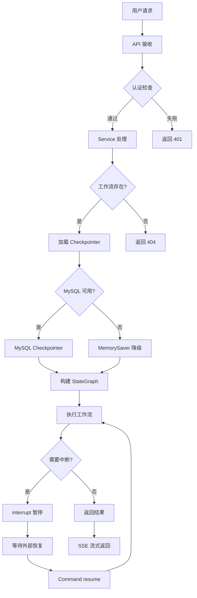
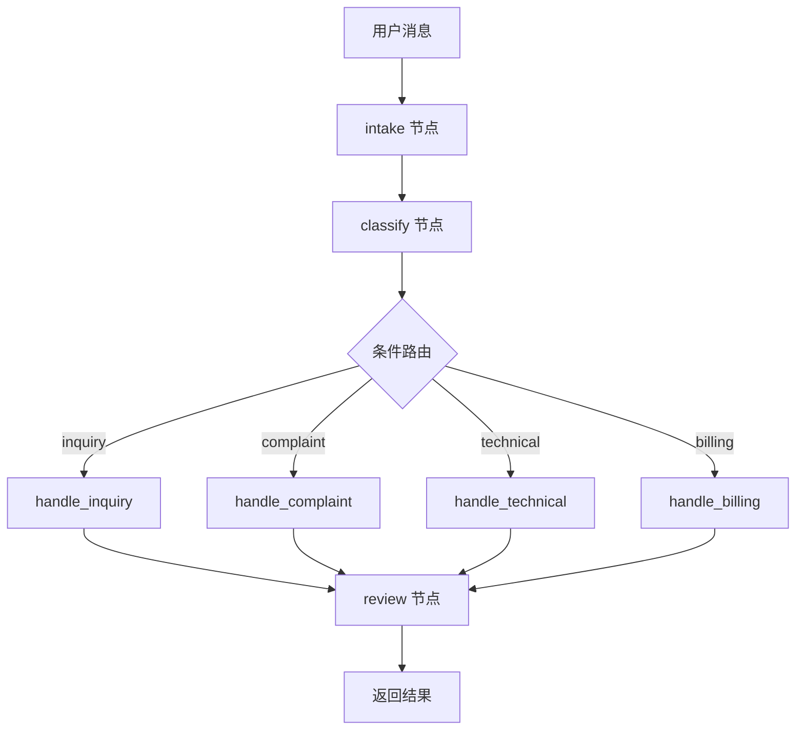
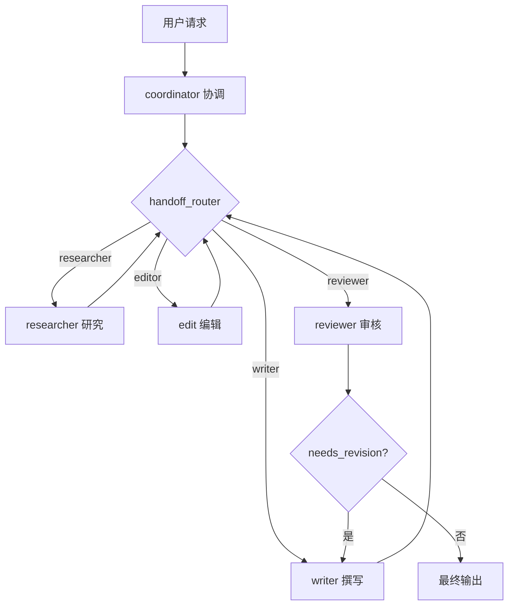

# x-langgraph

> 一个生产级的 LangGraph 工作流编排框架，提供**自动化推理**、**自主决策**、**多步推理**、**任务规划**等智能化工作流能力。

[](LICENSE)
[](https://www.python.org/)

## 项目简介

**x-langgraph** 是基于 LangGraph 构建的生产级工作流编排框架，专注于为复杂 LLM 应用场景提供：

- **自动化推理**：内置 ReAct、Tree-of-Thought、Plan-and-Execute 等主流推理模式
- **自主决策**：基于状态的条件路由 + LLM 驱动的动态决策
- **多步推理**：迭代式思考-行动-观察循环，支持中途反思与重规划
- **任务规划**：复杂任务自动分解、可视化执行追踪、动态调整计划

**适用场景**：

| 场景 | 典型用例 |
|------|----------|
| 智能客服 | 多轮对话、意图识别、工单流转、人机协作 |
| RAG 问答 | 知识库检索、上下文构建、多跳推理 |
| 多智能体协作 | 任务分解、角色协作、迭代优化 |
| 自动化审批 | 风险评估、自动/人工审批、断点恢复 |
| 复杂业务流程 | 条件路由、状态管理、长流程编排 |

**可视化界面**：提供基于 Vue 3 的工作流可视化编辑器，支持拖拽式节点编辑、条件路由配置、实时状态监控。

---

## 项目结构

```
x-langgraph/
├── server/                         # 后端 API 服务
│   ├── src/
│   │   ├── api/                   # API 接口层
│   │   │   ├── routes/            # 路由模块
│   │   │   └── router.py         # 路由注册
│   │   ├── core/                  # 核心支撑层
│   │   │   ├── config.py         # 配置管理
│   │   │   ├── logger.py         # 日志
│   │   │   ├── container.py      # IOC 容器
│   │   │   └── middleware.py     # 中间件
│   │   ├── services/              # 业务逻辑层
│   │   │   ├── chat_service.py
│   │   │   ├── approval_service.py
│   │   │   └── workflow_service.py
│   │   ├── repositories/         # 数据访问层
│   │   │   └── workflow_repository.py
│   │   ├── models/               # ORM 实体层
│   │   ├── infras/              # 基础设施层
│   │   │   ├── mysql.py
│   │   │   ├── redis.py
│   │   │   └── http_client.py
│   │   ├── schemas/              # Pydantic Schema
│   │   ├── llm/                 # LLM 提供者
│   │   │   ├── base.py
│   │   │   ├── deepseek.py
│   │   │   ├── doubao.py
│   │   │   └── aliyun.py
│   │   ├── tools/               # 工具模块
│   │   │   ├── weather/
│   │   │   ├── search/
│   │   │   └── calculation/
│   │   └── workflows/           # 工作流模块 ⭐
│   │       ├── base.py          # BaseWorkflow 基类
│   │       ├── compiler.py      # 图编译器
│   │       ├── checkpointer.py  # 状态持久化
│   │       ├── reasoning/       # 推理模块
│   │       │   ├── react.py
│   │       │   ├── tree_of_thought.py
│   │       │   └── plan_execute.py
│   │       ├── intent_classifier/
│   │       ├── customer_service/
│   │       ├── rag_qa/
│   │       ├── multi_agent/
│   │       └── approval/
│   ├── examples/                # 示例代码
│   ├── tests/                   # 测试代码
│   ├── data/                    # 工作流定义文件
│   ├── Dockerfile
│   └── docker-compose.yml
│
└── web/                         # 前端可视化界面（Vue 3）
    ├── src/
    │   ├── components/
    │   │   ├── graph/           # 工作流画布
    │   │   └── panels/         # 属性面板
    │   ├── stores/             # Pinia 状态管理
    │   ├── api/                # API 客户端
    │   ├── views/              # 页面视图
    │   └── router/
    └── package.json
```

---

## 系统架构

### 1. 分层架构

```
┌─────────────────────────────────────────────────────────────────┐
│                      API 接口层 (api)                            │
│         chat.py │ approval.py │ health.py │ metrics.py           │
└────────────────────────────┬────────────────────────────────────┘
                             │
                             ▼
┌─────────────────────────────────────────────────────────────────┐
│                    业务逻辑层 (services)                          │
│         ChatService │ ApprovalService │ WorkflowService          │
└────────────────────────────┬────────────────────────────────────┘
                             │
                             ▼
┌─────────────────────────────────────────────────────────────────┐
│                    数据访问层 (repositories)                       │
│                    WorkflowRepository                            │
└────────────────────────────┬────────────────────────────────────┘
                             │
              ┌──────────────┼──────────────┐
              ▼              ▼              ▼
┌─────────────────┐ ┌───────────────┐ ┌──────────────────────┐
│  ORM 实体层     │ │  基础设施层    │ │    核心支撑层         │
│    (models)    │ │   (infras)    │ │      (core)          │
│                │ │               │ │                      │
│ Workflow Model │ │ MySQL Session │ │ config.py            │
│                │ │ Redis Client │ │ logger.py            │
│                │ │ HTTP Client  │ │ middleware.py         │
│                │ │               │ │ container.py         │
└─────────────────┘ └───────────────┘ └──────────────────────┘
```

**层间依赖规则**：

```
api → service → repository
            repository → models
            repository → infras
```

- **API 层**：参数接收、鉴权、转发调用，不含业务逻辑
- **Service 层**：业务规则、事务编排、多仓储联动
- **Repository 层**：封装 CRUD、多表查询，依赖 infras 获取会话
- **Models 层**：纯数据表映射，无业务逻辑
- **Infra 层**：封装第三方客户端，**永不反向依赖上层**

### 2. 核心业务流程

#### 工作流执行流程


```mermaid
flowchart TD
    A[用户请求] --> B[API 接收]
    B --> C{认证检查}
    C -->|通过| D[Service 处理]
    C -->|失败| E[返回 401]
    D --> F{工作流存在?}
    F -->|是| G[加载 Checkpointer]
    F -->|否| H[返回 404]
    G --> I{MySQL 可用?}
    I -->|是| J[MySQL Checkpointer]
    I -->|否| K[MemorySaver 降级]
    J --> L[构建 StateGraph]
    K --> L
    L --> M[执行工作流]
    M --> N{需要中断?}
    N -->|是| O[interrupt 暂停]
    N -->|否| P[返回结果]
    O --> Q[等待外部恢复]
    Q --> R[Command resume]
    R --> M
    P --> S[SSE 流式返回]
```

#### 智能客服完整流程


```mermaid
flowchart TD
    START[用户消息] --> INTAKE[intake 节点]
    INTAKE --> CLASSIFY[classify 节点]
    CLASSIFY --> ROUTE{条件路由}
    ROUTE -->|inquiry| INQUIRY[handle_inquiry]
    ROUTE -->|complaint| COMPLAINT[handle_complaint]
    ROUTE -->|technical| TECHNICAL[handle_technical]
    ROUTE -->|billing| BILLING[handle_billing]
    INQUIRY --> REVIEW[review 节点]
    COMPLAINT --> REVIEW
    TECHNICAL --> REVIEW
    BILLING --> REVIEW
    REVIEW --> END[返回结果]
```

#### 多智能体协作流程


```mermaid
flowchart TD
    START[用户请求] --> COORD[coordinator 协调]
    COORD --> ROUTER{handoff_router}
    ROUTER -->|researcher| RESEARCH[researcher 研究]
    ROUTER -->|writer| WRITE[writer 撰写]
    ROUTER -->|editor| EDIT[edit 编辑]
    ROUTER -->|reviewer| REVIEW[reviewer 审核]
    RESEARCH --> ROUTER
    WRITE --> ROUTER
    EDIT --> ROUTER
    REVIEW --> NEED{needs_revision?}
    NEED -->|是| WRITE
    NEED -->|否| END[最终输出]
```

### 3. 模块依赖关系

```mermaid
graph LR
    subgraph "前端 (web)"
        WEB[Vue 3 应用]
    end

    subgraph "后端 (server/src)"
        subgraph "接口层"
            API[api/routes]
        end

        subgraph "业务层"
            SVC[services]
        end

        subgraph "数据层"
            REPO[repositories]
            MODELS[models]
        end

        subgraph "基础设施"
            INFRA[infras]
        end

        subgraph "核心支撑"
            CORE[core]
        end

        subgraph "工作流 ⭐"
            WF[workflows]
            WF --> BASE[base.py]
            WF --> REASONING[reasoning/]
            WF --> CHECKPOINT[checkpointer.py]
        end

        subgraph "LLM"
            LLM[llm/]
        end

        subgraph "工具"
            TOOLS[tools/]
        end
    end

    API --> SVC
    SVC --> REPO
    REPO --> MODELS
    REPO --> INFRA
    SVC --> WF
    SVC --> LLM
    WF --> LLM
    WF --> TOOLS
    API -.-> CORE
    SVC -.-> CORE
    REPO -.-> CORE
```

**依赖说明**：

| 层级 | 依赖关系 |
|------|----------|
| `workflows` | 依赖 `llm`、`tools`、`core/config` |
| `services` | 依赖 `workflows`、`llm`、`repositories` |
| `repositories` | 依赖 `models`、`infras/mysql` |
| `api` | 依赖 `services`、`schemas` |
| `core` | 被所有层级引用，但不反向依赖 |

---

## 核心能力

### 1. 多种推理模式

框架内置 **3 种推理模式**，可组合到具体工作流中使用：

| 模式 | 文件 | 工作流结构 | 适用场景 |
|------|------|------------|----------|
| **ReAct** | `react.py` | `reasoning → acting → observation → reflection` 循环 | 工具调用、搜索增强 |
| **Tree-of-Thought** | `tree_of_thought.py` | `generate → evaluate → select → ...` 树搜索 | 创意生成、方案探索 |
| **Plan-and-Execute** | `plan_execute.py` | `planner → executor → reflector → replan` | 复杂任务分解执行 |

### 2. 动态分支与条件路由

```python
# 多智能体 Handoff 模式
workflow.add_conditional_edges(
    "coordinator",
    handoff_router,
    {
        "researcher": "researcher",
        "writer": "writer",
        "editor": "editor",
        "reviewer": "reviewer",
    },
)
```

### 3. 状态持久化与断点恢复

- **MySQL Checkpointer**：生产级状态持久化
- **自动降级**：MySQL 不可用时回退到 MemorySaver
- **Human-in-the-Loop**：`interrupt` 中断 + `Command(resume)` 恢复

### 4. 多智能体协作

支持 Handoff 模式、并行任务、工具调用。

---

## 工作流示例

本框架内置 **5 种典型工作流**：

### 1. 意图分类路由

```
START → classify → [条件路由]
                   ├→ product_inquiry → END
                   ├→ order_status → END
                   ├→ technical_support → END
                   ├→ complaint → END
                   └→ billing → END
```
**特点**：LLM 意图分类 + 规则降级 + 6 类业务分发

### 2. 智能客服

```
START → intake → classify → [条件路由]
                   ├→ handle_inquiry → review → END
                   ├→ handle_complaint → review → END
                   ├→ handle_technical → review → END
                   └→ handle_billing → review → END
```
**特点**：多级条件路由 + Checkpointer 状态持久化 + 4 类工单处理

### 3. RAG 文档问答

```
START → init → [需要澄清?] → clarify → END
                    ↓
              retrieve → [检索充分?] → build_context → generate → END
                                     ↓
                               generate → END
```
**特点**：向量检索 + 上下文构建 + LLM 生成 + 降级处理

### 4. 多智能体协作

```
START → coordinator → [handoff_router]
                      ├→ researcher → [handoff_router]
                      │                ├→ writer
                      │                └→ ...
                      ├→ writer → [handoff_router]
                      ├→ editor → [handoff_router]
                      └→ reviewer → [needs_revision?] → writer
                                     ↓
                               [通过] → END
```
**特点**：Handoff 模式（Agent 间控制权传递）+ 5 种角色协作 + 迭代修订

### 5. 自动化审批

```
START → submit → evaluate → [风险评估路由]
                          ├→ auto_approve → notify → END
                          └→ human_approval → [interrupt] → notify → END
```
**特点**：自动评估 + 风险评估 + Human-in-the-Loop + 通知发送

---

## 快速开始

### 环境要求

- Python 3.11+
- uv 包管理器
- Docker Desktop（可选）

### 安装运行

```bash
# 克隆项目
git clone https://github.com/yeyushilai/x-langgraph.git
cd x-langgraph

# 安装依赖
cd server && uv sync

# 配置环境变量
cp .env.example .env
# 编辑 .env 配置 LLM API Key

# Docker 一键启动（推荐）
docker-compose up -d

# 或本地开发
uv run python -m examples.hello_world
```

### 运行推理示例

```python
# ReAct 推理
from workflows.reasoning import ReactWorkflow, ReasoningConfig

config = ReasoningConfig(max_iterations=5)
workflow = ReactWorkflow(config=config, tools={"search": search_tool})
result = await workflow.ainvoke({"messages": [HumanMessage(content="...")]})

# Plan-and-Execute 规划执行
from workflows.reasoning import create_plan_execute_workflow

workflow = create_plan_execute_workflow(config)
result = workflow.run("帮我分析竞争对手并制定营销策略")
```

---

## 核心特性

| 特性 | 说明 |
|------|------|
| **多推理模式** | ReAct、Tree-of-Thought、Plan-and-Execute |
| **多智能体协作** | Handoff 模式、角色分工、迭代优化 |
| **状态持久化** | MySQL Checkpointer + 自动降级 |
| **Human-in-the-Loop** | interrupt/resume 人机交互 |
| **多 LLM 支持** | DeepSeek、豆包、阿里云通义 |
| **流式输出** | SSE 流式响应 |
| **统一基类** | 所有工作流继承 BaseWorkflow |
| **分层架构** | API → Service → Repository → Models → Infra |
| **Docker 部署** | 一键容器化部署 |
| **可视化编辑** | Vue Flow 工作流编辑器 |

---

## 技术栈

### 后端

| 分类 | 技术 |
|------|------|
| Web 框架 | FastAPI + Uvicorn |
| LLM 框架 | LangGraph + LangChain |
| 数据存储 | MySQL + SQLAlchemy |
| 数据验证 | Pydantic |
| 日志 | Loguru |
| 包管理 | uv |

### 前端

| 分类 | 技术 |
|------|------|
| 框架 | Vue 3 + TypeScript |
| 构建 | Vite |
| 状态管理 | Pinia |
| 图可视化 | Vue Flow |
| UI | Tailwind CSS |

---

## API 文档

服务启动后访问：

- Swagger UI: http://localhost:8000/docs
- ReDoc: http://localhost:8000/redoc

### 核心接口

| 接口 | 方法 | 说明 |
|------|------|------|
| `/chat` | POST | 聊天对话 |
| `/chat/stream` | POST | 流式聊天 |
| `/workflows/{name}/execute` | POST | 执行工作流 |
| `/workflows/{name}/stream` | POST | 流式执行 |
| `/approval/resume` | POST | 恢复审批 |

---

## 许可证

MIT License

## 参考资料

- [LangGraph 官方文档](https://langchain-ai.github.io/langgraph/)
- [LangGraph 中文教程](https://langchain-doc.cn/v1/python/langgraph/)
- [FastAPI 官方文档](https://fastapi.tiangolo.com/)

---

**让我们一起探索 LangGraph 的无限可能！** 🚀
