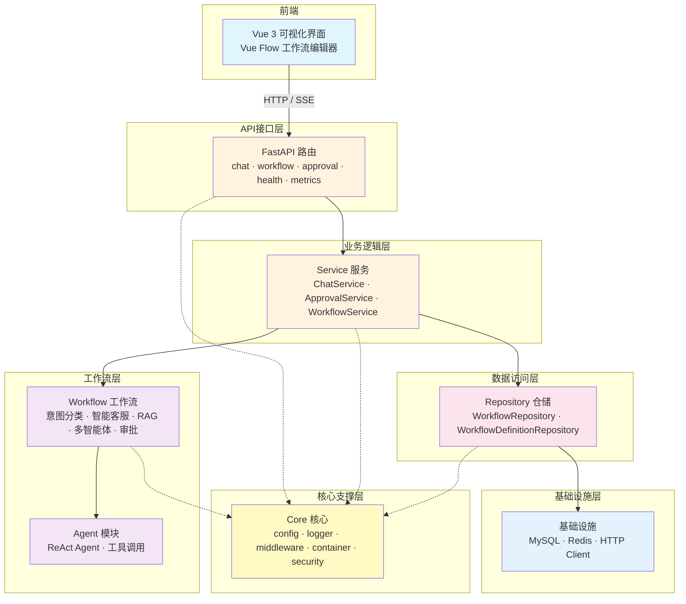
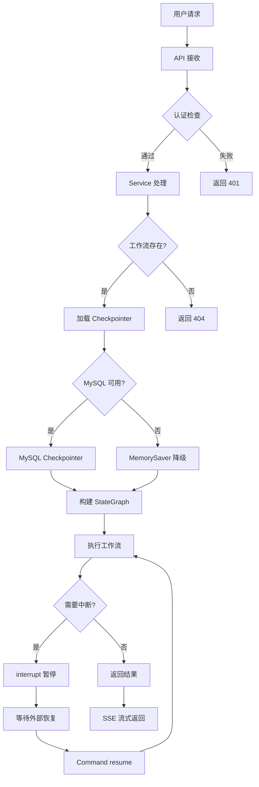
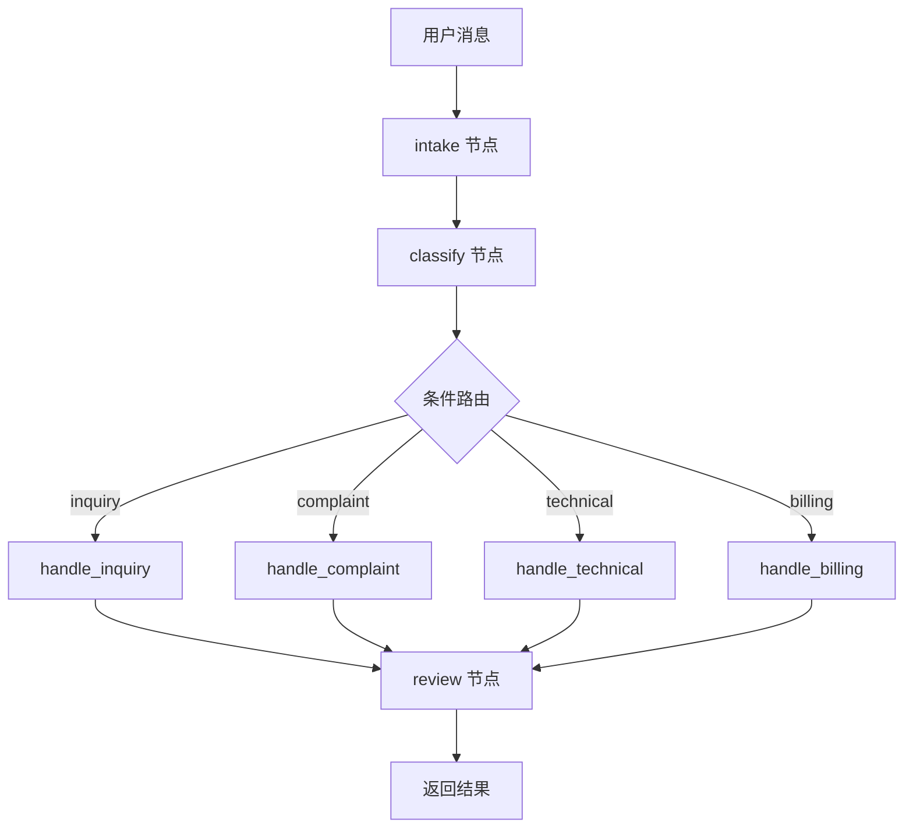
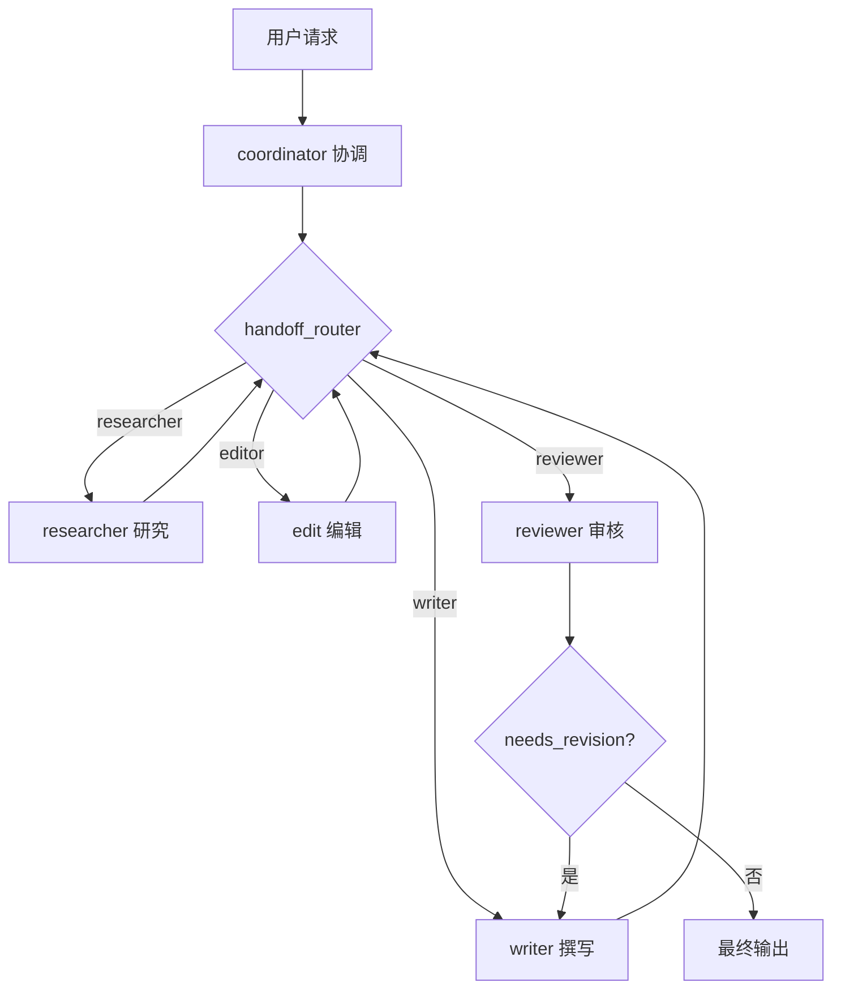

[English](README.en.md) | 中文

# x-langgraph

[](LICENSE)
[](https://www.python.org/)
[](https://langchain-ai.github.io/langgraph/)

## 项目简介

**x-langgraph** 是基于 LangGraph 构建的生产级工作流编排框架，为复杂 LLM 应用场景提供**自动化推理**、**自主决策**、**多步推理**与**任务规划**能力。

**核心价值**：
- 内置 ReAct、Tree-of-Thought、Plan-and-Execute 三种推理模式，开箱即用
- 基于状态图的条件路由 + LLM 驱动的动态决策引擎
- 支持 Human-in-the-Loop 人机协作与断点恢复
- 分层架构（API → Service → Workflow → Repository → Infra），易于扩展与维护
- 提供 Vue 3 可视化工作流编辑器，支持拖拽式节点编排

**适用场景**：智能客服、RAG 文档问答、多智能体协作、自动化审批、复杂业务流程编排。

---

## 快速开始

### 1. 环境要求

| 依赖项 | 版本要求 | 说明 |
|--------|----------|------|
| Python | >= 3.11 | 推荐 3.11 或 3.12 |
| uv | 最新版 | Python 包管理器，替代 pip |
| Docker | >= 20.10 | 可选，用于容器化部署 |
| Docker Compose | >= 2.0 | 可选，用于编排多容器 |
| Node.js | >= 18 | 可选，仅前端开发需要 |
| MySQL | >= 8.0 | 可选，用于状态持久化 |

**平台适配**：

| 平台 | 安装说明 |
|------|----------|
| **Windows** | 安装 [Python 3.11+](https://www.python.org/downloads/windows/)、[Git](https://git-scm.com/download/win)、[uv](https://docs.astral.sh/uv/getting-started/installation/)；推荐使用 PowerShell 或 Git Bash |
| **Linux** | `sudo apt install python3.11 python3.11-venv git`（Ubuntu/Debian）；uv 通过 `curl -LsSf https://astral.sh/uv/install.sh \| sh` 安装 |
| **macOS** | `brew install python@3.11 git`；uv 通过 `curl -LsSf https://astral.sh/uv/install.sh \| sh` 安装 |

### 2. 项目代码克隆

```bash
git clone https://github.com/chain-engine/x-langgraph.git
cd x-langgraph
```

### 3. 依赖同步安装

```bash
# 进入后端目录
cd server

# 使用 uv 安装依赖（推荐）
uv sync

# 安装开发依赖（可选）
uv sync --extra dev
```

> 本项目使用 uv 管理依赖，非必要不使用 pip。如需使用 pip，请先激活虚拟环境：`uv venv && source .venv/bin/activate`（Linux/macOS）或 `.venv\Scripts\activate`（Windows）。

### 4. 环境配置

```bash
# 复制环境变量模板
cp .env.example .env
```

编辑 `.env` 文件，配置核心参数：

| 参数 | 说明 | 示例 |
|------|------|------|
| `DEEPSEEK_API_KEY` | DeepSeek API 密钥 | `sk-xxx` |
| `DEEPSEEK_API_BASE` | DeepSeek API 地址 | `https://api.deepseek.com/v1` |
| `DEEPSEEK_MODEL_NAME` | DeepSeek 模型名称 | `deepseek-chat` |
| `DOUBAO_API_KEY` | 豆包 API 密钥 | `sk-xxx` |
| `DOUBAO_API_BASE` | 豆包 API 地址 | `https://ark.cn-beijing.volces.com/api/v3` |
| `ALIYUN_API_KEY` | 阿里云百炼 API 密钥 | `sk-xxx` |
| `ALIYUN_API_BASE` | 阿里云百炼 API 地址 | `https://dashscope.aliyuncs.com/compatible-mode/v1` |
| `DB_HOST` | MySQL 主机地址 | `localhost` |
| `DB_PORT` | MySQL 端口 | `3306` |
| `DB_USER` | MySQL 用户名 | `root` |
| `DB_PASSWORD` | MySQL 密码 | `your_password` |
| `DB_NAME` | MySQL 数据库名 | `x-langgraph` |

> 至少配置一个 LLM 提供者的 API Key。优先级：Mimo > DeepSeek > 豆包 > 阿里云 > Mock。

### 5. 服务启动

#### 方式一：本地开发热重载（推荐）

```bash
cd server
uv run python -m src.main
```

服务启动后访问：http://localhost:8000

#### 方式二：Docker 容器部署

```bash
cd server
docker-compose up -d
```

包含 MySQL 数据库 + FastAPI 应用两个容器，一键启动。

#### 方式三：uvicorn 直接启动

```bash
cd server
uv run uvicorn src.main:app --host 0.0.0.0 --port 8000 --reload
```

### 6. 常用工程命令

```bash
# 运行单元测试
uv run pytest

# 代码格式化
uv run black src/ tests/

# 静态代码检查
uv run ruff check src/ tests/

# 类型检查
uv run mypy src/

# 依赖漏洞扫描
uv run pip-audit
```

### 7. 使用方法示例

#### API 调用示例

```bash
# 聊天对话
curl -X POST http://localhost:8000/v1/chat/execute \
  -H "Content-Type: application/json" \
  -d '{"message": "你好，请介绍一下自己", "workflow_name": "customer_service"}'

# 流式聊天
curl -X POST http://localhost:8000/v1/chat/stream \
  -H "Content-Type: application/json" \
  -d '{"message": "帮我分析一下天气", "workflow_name": "react"}'
```

#### Python SDK 示例

```python
from src.workflows.base import BaseWorkflow
from src.workflows.compiler import WorkflowCompiler

# 使用 ReAct 推理模式
config = {"max_iterations": 5, "tools": ["search", "weather"]}
compiler = WorkflowCompiler()
workflow = compiler.compile("react", config)
result = workflow.invoke({"messages": [("user", "今天北京天气怎么样？")]})
```

---

## 项目结构

```
x-langgraph/
├── server/                              # 后端 API 服务
│   ├── src/
│   │   ├── main.py                      # 应用主入口
│   │   ├── api/                         # API 接口层
│   │   │   ├── router.py               # 路由注册
│   │   │   └── v1/                     # API v1 版本
│   │   │       ├── chat.py             # 聊天接口
│   │   │       ├── workflow.py         # 工作流管理接口
│   │   │       ├── approval.py         # 审批接口
│   │   │       ├── health.py           # 健康检查接口
│   │   │       └── metrics.py          # 监控指标接口
│   │   ├── core/                        # 核心支撑层
│   │   │   ├── config.py               # 配置管理（环境变量 + YAML）
│   │   │   ├── logger.py               # 日志（Loguru）
│   │   │   ├── container.py            # IOC 依赖注入容器
│   │   │   ├── middleware.py           # 中间件
│   │   │   ├── security.py             # 安全认证
│   │   │   └── exceptions.py           # 异常定义
│   │   ├── services/                    # 业务逻辑层
│   │   │   ├── chat_service.py         # 聊天服务
│   │   │   ├── approval_service.py     # 审批服务
│   │   │   └── workflow_service.py     # 工作流定义服务
│   │   ├── workflows/                   # 工作流模块
│   │   │   ├── base.py                 # BaseWorkflow 基类
│   │   │   ├── compiler.py             # 图编译器
│   │   │   ├── checkpointer.py         # 状态持久化
│   │   │   ├── intent_classifier/      # 意图分类路由工作流
│   │   │   ├── customer_service/       # 智能客服工作流
│   │   │   ├── rag_qa/                 # RAG 文档问答工作流
│   │   │   ├── multi_agent/            # 多智能体协作工作流
│   │   │   └── approval/               # 自动化审批工作流
│   │   ├── agent/                       # Agent 模块
│   │   │   ├── base.py                 # Agent 基类
│   │   │   ├── react_agent.py          # ReAct Agent
│   │   │   ├── factory.py              # Agent 工厂
│   │   │   └── registry.py             # Agent 注册表
│   │   ├── llms/                        # LLM 提供者
│   │   │   ├── providers.py            # 多 LLM 统一接口
│   │   │   └── prompts.py              # Prompt 模板
│   │   ├── tools/                       # 工具模块
│   │   │   ├── weather_tool.py         # 天气查询工具
│   │   │   ├── search_tools.py         # 搜索工具
│   │   │   └── calculation_tools.py    # 计算工具
│   │   ├── repositories/               # 数据访问层
│   │   │   ├── workflow_repository.py
│   │   │   └── workflow_definition_repository.py
│   │   ├── models/                      # ORM 实体层
│   │   ├── schemas/                     # Pydantic Schema
│   │   ├── infras/                      # 基础设施层
│   │   │   ├── mysql.py                # MySQL 连接
│   │   │   ├── redis.py                # Redis 连接
│   │   │   └── http_client.py          # HTTP 客户端
│   │   └── constants/                   # 常量定义
│   ├── tests/                           # 测试代码
│   ├── examples/                        # 示例代码
│   ├── data/                            # 工作流定义文件
│   ├── pyproject.toml                   # 项目配置（依赖、构建）
│   ├── .env.example                     # 环境变量模板
│   ├── Dockerfile                       # Docker 镜像构建
│   └── docker-compose.yml               # Docker Compose 编排
│
└── web/                                 # 前端可视化界面（Vue 3）
    ├── src/
    │   ├── components/                  # 组件
    │   │   ├── graph/                   # 工作流画布（Vue Flow）
    │   │   └── panels/                  # 属性面板
    │   ├── views/                       # 页面视图
    │   ├── stores/                      # Pinia 状态管理
    │   ├── api/                         # API 客户端
    │   └── router/                      # 路由配置
    ├── package.json                     # 前端依赖
    └── vite.config.ts                   # Vite 构建配置
```

**核心目录说明**：

| 目录 | 作用 |
|------|------|
| `server/src/api/` | HTTP 接口层，负责请求接收、参数校验、响应返回 |
| `server/src/services/` | 业务逻辑层，编排工作流执行、审批流程、聊天管理 |
| `server/src/workflows/` | 工作流定义层，5 种内置工作流的核心实现 |
| `server/src/agent/` | Agent 模块，ReAct Agent 与工具调用 |
| `server/src/llms/` | LLM 统一接口，支持 DeepSeek、豆包、阿里云 |
| `server/src/repositories/` | 数据访问层，封装数据库操作 |
| `server/src/infras/` | 基础设施层，MySQL、Redis、HTTP 客户端 |
| `web/src/components/graph/` | 前端工作流画布，基于 Vue Flow 的可视化编辑器 |

---

## 系统架构

### 系统分层架构


```mermaid
flowchart TB
    subgraph 前端
        WEB["Vue 3 可视化界面<br>Vue Flow 工作流编辑器"]
    end

    subgraph API接口层
        API["FastAPI 路由<br>chat · workflow · approval · health · metrics"]
    end

    subgraph 业务逻辑层
        SVC["Service 服务<br>ChatService · ApprovalService · WorkflowService"]
    end

    subgraph 工作流层
        WF["Workflow 工作流<br>意图分类 · 智能客服 · RAG · 多智能体 · 审批"]
        AGENT["Agent 模块<br>ReAct Agent · 工具调用"]
    end

    subgraph 数据访问层
        REPO["Repository 仓储<br>WorkflowRepository · WorkflowDefinitionRepository"]
    end

    subgraph 基础设施层
        INFRA["基础设施<br>MySQL · Redis · HTTP Client"]
    end

    subgraph 核心支撑层
        CORE["Core 核心<br>config · logger · middleware · container · security"]
    end

    WEB -->|"HTTP / SSE"| API
    API --> SVC
    SVC --> WF
    SVC --> REPO
    WF --> AGENT
    REPO --> INFRA

    API -.-> CORE
    SVC -.-> CORE
    WF -.-> CORE
    REPO -.-> CORE

    style WEB fill:#e1f5fe
    style API fill:#fff3e0
    style SVC fill:#fff3e0
    style WF fill:#f3e5f5
    style AGENT fill:#f3e5f5
    style REPO fill:#fce4ec
    style INFRA fill:#e3f2fd
    style CORE fill:#fff9c4
```

**层间依赖规则**：`前端 → API → Service → Workflows/Repositories → Infra`（Core 被所有层引用）

### 工作流执行流程


```mermaid
flowchart TD
    A[用户请求] --> B[API 接收]
    B --> C{认证检查}
    C -->|通过| D[Service 处理]
    C -->|失败| E[返回 401]
    D --> F{工作流存在?}
    F -->|是| G[加载 Checkpointer]
    F -->|否| H[返回 404]
    G --> I{MySQL 可用?}
    I -->|是| J[MySQL Checkpointer]
    I -->|否| K[MemorySaver 降级]
    J --> L[构建 StateGraph]
    K --> L
    L --> M[执行工作流]
    M --> N{需要中断?}
    N -->|是| O[interrupt 暂停]
    N -->|否| P[返回结果]
    O --> Q[等待外部恢复]
    Q --> R[Command resume]
    R --> M
    P --> S[SSE 流式返回]
```

### 智能客服流程


```mermaid
flowchart TD
    START[用户消息] --> INTAKE[intake 节点]
    INTAKE --> CLASSIFY[classify 节点]
    CLASSIFY --> ROUTE{条件路由}
    ROUTE -->|inquiry| INQUIRY[handle_inquiry]
    ROUTE -->|complaint| COMPLAINT[handle_complaint]
    ROUTE -->|technical| TECHNICAL[handle_technical]
    ROUTE -->|billing| BILLING[handle_billing]
    INQUIRY --> REVIEW[review 节点]
    COMPLAINT --> REVIEW
    TECHNICAL --> REVIEW
    BILLING --> REVIEW
    REVIEW --> END[返回结果]
```

### 多智能体协作流程


```mermaid
flowchart TD
    START[用户请求] --> COORD[coordinator 协调]
    COORD --> ROUTER{handoff_router}
    ROUTER -->|researcher| RESEARCH[researcher 研究]
    ROUTER -->|writer| WRITE[writer 撰写]
    ROUTER -->|editor| EDIT[edit 编辑]
    ROUTER -->|reviewer| REVIEW[reviewer 审核]
    RESEARCH --> ROUTER
    WRITE --> ROUTER
    EDIT --> ROUTER
    REVIEW --> NEED{needs_revision?}
    NEED -->|是| WRITE
    NEED -->|否| END[最终输出]
```

---

## 技术栈

| 分类 | 技术 | 说明 |
|------|------|------|
| **开发语言** | Python 3.11+ | 后端主语言 |
| **Web 框架** | FastAPI + Uvicorn | 高性能异步 API 框架 |
| **LLM 框架** | LangGraph + LangChain | 工作流编排与 LLM 集成 |
| **数据存储** | MySQL 8.0 + SQLAlchemy | 关系型数据库 + ORM |
| **缓存** | Redis | 可选，用于缓存与会话管理 |
| **数据验证** | Pydantic v2 | 类型安全的数据模型 |
| **日志** | Loguru | 结构化日志 |
| **包管理** | uv | 高速 Python 包管理器 |
| **前端框架** | Vue 3 + TypeScript | 响应式前端框架 |
| **前端构建** | Vite | 快速构建工具 |
| **图可视化** | Vue Flow | 工作流画布编辑器 |
| **UI 框架** | Tailwind CSS | 原子化 CSS 框架 |
| **状态管理** | Pinia | Vue 3 状态管理 |
| **部署运维** | Docker + Docker Compose | 容器化部署 |

---

## API 文档说明

服务启动后，可通过以下地址访问 API 文档：

| 文档类型 | 访问地址 | 说明 |
|----------|----------|------|
| Swagger UI | http://localhost:8000/docs | 交互式 API 文档，支持在线调试 |
| ReDoc | http://localhost:8000/redoc | 只读 API 文档，结构清晰 |
| OpenAPI JSON | http://localhost:8000/openapi.json | OpenAPI 3.0 规范文件 |

### 核心 API 接口清单

| 接口路径 | 方法 | 说明 |
|----------|------|------|
| `/v1/chat/execute` | POST | 聊天对话（同步） |
| `/v1/chat/stream` | POST | 流式聊天（SSE） |
| `/v1/workflows` | GET | 获取工作流列表 |
| `/v1/workflows/{name}` | GET | 获取工作流详情 |
| `/v1/workflows` | POST | 创建工作流 |
| `/v1/workflows/{name}` | PUT | 更新工作流 |
| `/v1/workflows/{name}` | DELETE | 删除工作流 |
| `/v1/workflows/{name}/nodes` | POST | 添加节点 |
| `/v1/workflows/{name}/nodes` | PUT | 更新节点 |
| `/v1/workflows/{name}/nodes` | DELETE | 删除节点 |
| `/v1/workflows/{name}/edges` | POST | 添加边 |
| `/v1/workflows/{name}/edges` | PUT | 更新边 |
| `/v1/workflows/{name}/edges` | DELETE | 删除边 |
| `/v1/workflows/{name}/execute` | POST | 执行工作流 |
| `/v1/workflows/{name}/stream` | POST | 流式执行工作流 |
| `/v1/approval/resume` | POST | 恢复审批流程 |
| `/v1/approval/status/{session_id}` | GET | 查询审批状态 |
| `/v1/health` | GET | 健康检查 |
| `/v1/metrics` | GET | 监控指标 |

**权限控制**：当前版本 API 接口无认证要求（开发模式）。生产环境建议通过 `API_KEY` 环境变量配置访问密钥，或集成 OAuth2 / JWT 认证。

---

## 存储配置说明

### MySQL 数据库

用于 LangGraph Checkpoint 状态持久化和工作流定义存储。

| 参数 | 环境变量 | 默认值 | 说明 |
|------|----------|--------|------|
| 主机地址 | `DB_HOST` | `localhost` | MySQL 服务器地址 |
| 端口 | `DB_PORT` | `3306` | MySQL 服务端口 |
| 用户名 | `DB_USER` | `root` | 数据库用户名 |
| 密码 | `DB_PASSWORD` | - | 数据库密码 |
| 数据库名 | `DB_NAME` | - | 数据库名称 |
| 连接池大小 | `DB_POOL_SIZE` | `10` | 连接池最大连接数 |
| 最大溢出 | `DB_MAX_OVERFLOW` | `20` | 超出连接池的额外连接数 |

**注意事项**：
- MySQL 不可用时，系统自动降级为内存 Checkpointer（MemorySaver），数据不会持久化
- Docker Compose 部署会自动初始化 MySQL 容器

### Redis（可选）

用于缓存和会话管理。

| 参数 | 环境变量 | 默认值 | 说明 |
|------|----------|--------|------|
| 主机地址 | `REDIS_HOST` | `localhost` | Redis 服务器地址 |
| 端口 | `REDIS_PORT` | `6379` | Redis 服务端口 |
| 密码 | `REDIS_PASSWORD` | - | Redis 密码 |
| 数据库 | `REDIS_DB` | `0` | Redis 数据库编号 |

### 本地文件存储

工作流定义文件存储在 `server/data/` 目录下，日志文件输出到 `server/logs/` 目录。

---

## 许可证

本项目基于 [MIT License](LICENSE) 开源。

---

## 参考资料

| 技术 | 官方文档 |
|------|----------|
| Python | https://www.python.org/ |
| uv | https://docs.astral.sh/uv/ |
| LangGraph | https://langchain-ai.github.io/langgraph/ |
| LangChain | https://python.langchain.com/ |
| FastAPI | https://fastapi.tiangolo.com/ |
| SQLAlchemy | https://docs.sqlalchemy.org/ |
| Pydantic | https://docs.pydantic.dev/ |
| Loguru | https://loguru.readthedocs.io/ |
| Docker | https://docs.docker.com/ |
| Vue 3 | https://vuejs.org/ |
| Vue Flow | https://vueflow.dev/ |
| Tailwind CSS | https://tailwindcss.com/ |

---

## 联系方式

- **作者**：John Young（夜雨诗来）
- **邮箱**：john.young@foxmail.com
- **Gitee**：https://gitee.com/yeyushilai
- **GitHub**：https://github.com/yeyushilai
- **项目地址**：https://github.com/chain-engine/x-langgraph
